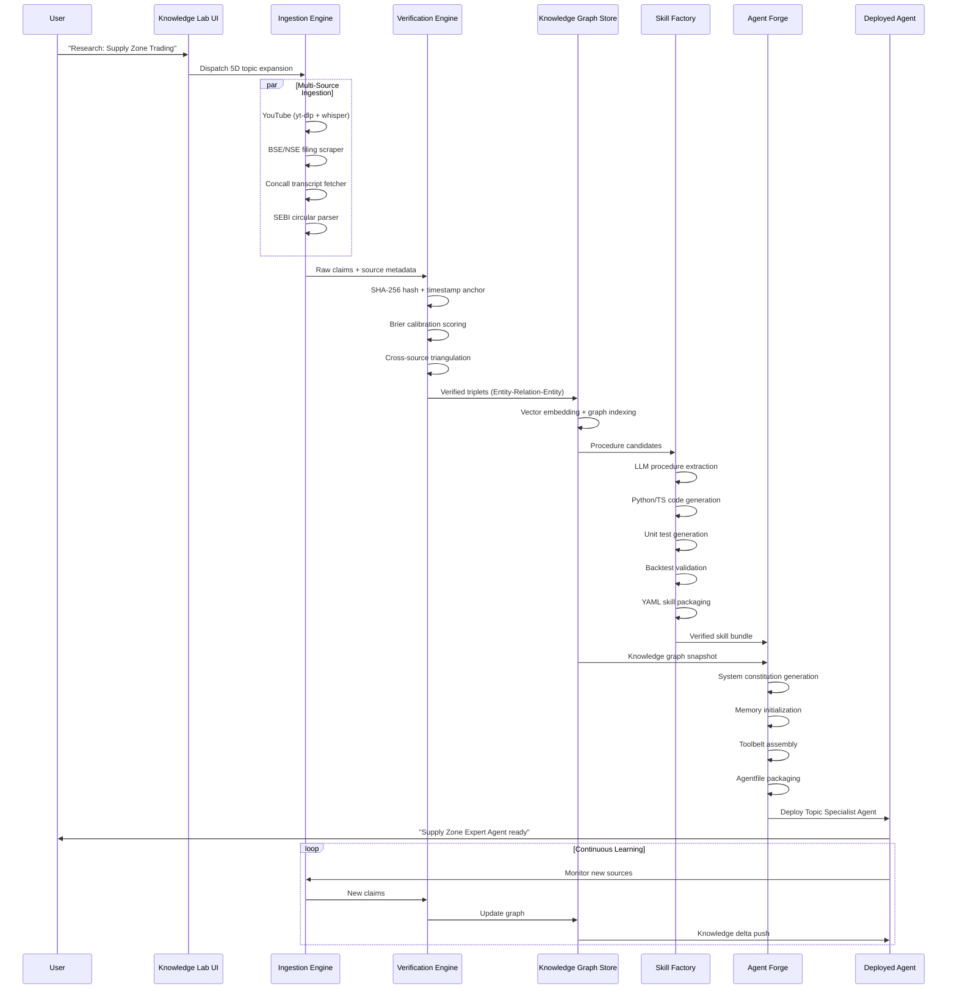
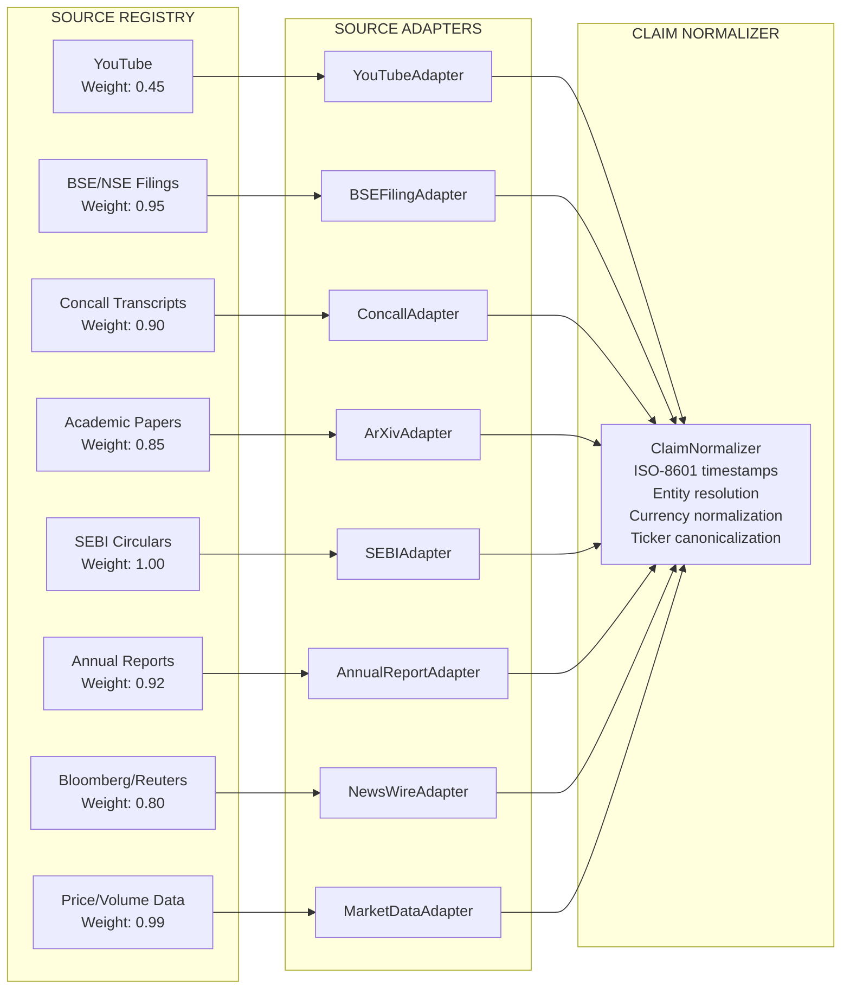

# NRI WealthOS: Collective Knowledge Synthesis & Autonomous Agent Creation Architecture

## YRIKS → AGENT FORGE: Complete Technical Specification v3.0

---

```
╔══════════════════════════════════════════════════════════════════════════════════════╗
║          NRI WealthOS — KNOWLEDGE SYNTHESIS & AUTONOMOUS AGENT ARCHITECTURE         ║
║                    Chief AI Systems Architect Review — v3.0                         ║
║         YRIKS Enhancement → Collective Knowledge → Executable Agent Forge           ║
╚══════════════════════════════════════════════════════════════════════════════════════╝
```

---

## TABLE OF CONTENTS

1. [Executive Audit of Current Functionality](#1-executive-audit)
2. [System Architecture Overview](#2-system-architecture-overview)
3. [Collective & Verified Knowledge Enhancement Blueprint](#3-collective--verified-knowledge-blueprint)
4. [Skill Factory: Passive Knowledge → Executable Agent Skills](#4-skill-factory)
5. [Agent Forge: Autonomous Topic Agent Creation Architecture](#5-agent-forge)
6. [Implementation Roadmap & Production Code Blueprints](#6-implementation-roadmap--production-code)
7. [Database Schema Extensions](#7-database-schema-extensions)
8. [Frontend UI/UX: Knowledge Lab → Agent Forge Tab](#8-frontend-uiux-knowledge-lab)
9. [Security, Compliance & ZFA Integration](#9-security-compliance--zfa-integration)
10. [Testing & Validation Framework](#10-testing--validation-framework)

---

## 1. EXECUTIVE AUDIT

### 1.1 What Works Brilliantly

```
┌─────────────────────────────────────────────────────────────────────────────┐
│                    YRIKS STRENGTHS ASSESSMENT MATRIX                        │
├──────────────────────────────┬──────────────────┬───────────────────────────┤
│ Component                    │ Maturity Score   │ Production Readiness      │
├──────────────────────────────┼──────────────────┼───────────────────────────┤
│ 5D Topic Expansion           │ ████████░░ 8/10  │ ✅ Production Ready        │
│ Dual-Path Audio Pipeline     │ █████████░ 9/10  │ ✅ Production Ready        │
│ ZFA v2.1 (SHA-256 + anchors) │ █████████░ 9/10  │ ✅ Production Ready        │
│ Dialectic Debate Matrix      │ ████████░░ 8/10  │ ✅ Production Ready        │
│ App Feature Synthesis        │ ███████░░░ 7/10  │ ⚠️  Needs Structuring      │
│ Live Browser Tab Capture     │ ████████░░ 8/10  │ ✅ Production Ready        │
│ Universal Knowledge Compiler │ ████████░░ 8/10  │ ✅ Production Ready        │
│ 750-Stock Backtest Engine    │ ████████░░ 8/10  │ ✅ Production Ready        │
└──────────────────────────────┴──────────────────┴───────────────────────────┘
```

**ZFA v2.1 — Cryptographic Integrity**: The SHA-256 transcript hashing with timestamp-anchored claims is architecturally sound. This is the correct foundation for a verified knowledge system. Every claim has a provenance chain — this is non-negotiable for financial intelligence.

**Dual-Path Transcription**: The yt-dlp → faster-whisper fallback with ephemeral audio deletion is production-grade. The garbage collection pattern prevents storage bloat and legal exposure.

**Dialectic Debate Matrix**: TF-IDF + cosine similarity clustering across 25+ videos to extract opposing theses is genuinely sophisticated. This prevents the single-source anchoring problem that plagues most retail research tools.

**5D Topic Expansion**: The multilingual ontology (Hindi/Tamil/Telugu/Gujarati/Marathi) with colloquial jargon is a genuine competitive moat for NRI users.

---

### 1.2 Critical Architectural Gaps & Bottlenecks

```
╔═══════════════════════════════════════════════════════════════════════════════╗
║                    CRITICAL GAP ANALYSIS — AGENT CREATION BLOCKERS           ║
╠═══════════════════════════════════════════════════════════════════════════════╣
║                                                                               ║
║  GAP #1: KNOWLEDGE IS UNSTRUCTURED TEXT, NOT EXECUTABLE TRIPLETS             ║
║  ─────────────────────────────────────────────────────────────────────────── ║
║  Current: Transcripts → Markdown summaries → NotebookLM dossier              ║
║  Problem: An agent cannot "run" a Markdown paragraph. It needs typed,        ║
║           parameterized, testable procedures.                                 ║
║  Impact:  CRITICAL — Blocks all autonomous execution                         ║
║                                                                               ║
║  GAP #2: NO PERSISTENT KNOWLEDGE GRAPH                                       ║
║  ─────────────────────────────────────────────────────────────────────────── ║
║  Current: Each research session is isolated. No cross-session entity         ║
║           resolution. "Nifty 50" in session A ≠ linked to session B.        ║
║  Problem: Knowledge doesn't compound. Agent has no long-term memory.         ║
║  Impact:  CRITICAL — Prevents collective knowledge accumulation              ║
║                                                                               ║
║  GAP #3: NO CROSS-SOURCE TRIANGULATION                                       ║
║  ─────────────────────────────────────────────────────────────────────────── ║
║  Current: YouTube-only. No BSE/NSE filings, concall transcripts,             ║
║           academic papers, SEBI circulars.                                   ║
║  Problem: YouTube influencers have high noise-to-signal ratio.               ║
║           Unverified claims get embedded as "knowledge."                     ║
║  Impact:  HIGH — Compromises knowledge quality                               ║
║                                                                               ║
║  GAP #4: NO SKILL EXTRACTION PIPELINE                                        ║
║  ─────────────────────────────────────────────────────────────────────────── ║
║  Current: "App Feature Synthesis" produces natural language blueprints.      ║
║  Problem: No automated conversion to Python/TypeScript callable tools.       ║
║           No input schema, no validation gates, no unit tests.               ║
║  Impact:  CRITICAL — Agent has no executable toolbelt                        ║
║                                                                               ║
║  GAP #5: NO AGENT PACKAGING FORMAT                                           ║
║  ─────────────────────────────────────────────────────────────────────────── ║
║  Current: Research output is a static dossier (PDF/Markdown).                ║
║  Problem: No Agentfile, no system prompt constitution, no memory             ║
║           initialization, no tool manifest.                                  ║
║  Impact:  CRITICAL — Cannot deploy an agent from research output             ║
║                                                                               ║
║  GAP #6: NO CONSENSUS SCORING / CLAIM CREDIBILITY WEIGHTING                 ║
║  ─────────────────────────────────────────────────────────────────────────── ║
║  Current: All sources treated equally. A SEBI-registered analyst and a       ║
║           clickbait influencer have identical epistemic weight.              ║
║  Problem: Garbage-in-garbage-out for agent knowledge base.                   ║
║  Impact:  HIGH — Degrades agent decision quality                             ║
║                                                                               ║
║  GAP #7: NO CONTINUOUS LEARNING LOOP                                         ║
║  ─────────────────────────────────────────────────────────────────────────── ║
║  Current: Research is a one-shot batch process.                              ║
║  Problem: Agent knowledge becomes stale. Quarterly concalls, new SEBI        ║
║           circulars, price regime changes not auto-ingested.                 ║
║  Impact:  HIGH — Agent degrades over time                                    ║
║                                                                               ║
╚═══════════════════════════════════════════════════════════════════════════════╝
```

---

## 2. SYSTEM ARCHITECTURE OVERVIEW

### 2.1 Complete System Architecture — Current vs Target State

```mermaid
graph TB
    subgraph CURRENT["CURRENT STATE — YRIKS v1.0"]
        YT[YouTube Videos] --> TP[Transcription Pipeline]
        TP --> ZFA[ZFA v2.1 Verification]
        ZFA --> DDM[Dialectic Debate Matrix]
        DDM --> AFS[App Feature Synthesis]
        AFS --> MD[Markdown Dossier]
        MD --> NLM[NotebookLM Export]
    end

    subgraph TARGET["TARGET STATE — YRIKS + AGENT FORGE v3.0"]
        subgraph INGESTION["LAYER 1: MULTI-SOURCE INGESTION"]
            YT2[YouTube] 
            BSE[BSE/NSE Filings]
            CC[Concall Transcripts]
            AP[Academic Papers]
            SEBI[SEBI Circulars]
            PRICE[Price/Volume Data]
        end

        subgraph VERIFICATION["LAYER 2: VERIFICATION ENGINE"]
            ZFA2[ZFA v2.1+]
            CS[Consensus Scorer]
            KGV[Knowledge Graph Verifier]
            BRIER[Brier Calibration]
        end

        subgraph KNOWLEDGE["LAYER 3: KNOWLEDGE STORE"]
            VDB[(Vector DB\nChroma/Qdrant)]
            KG[(Knowledge Graph\nSQLite+RDF)]
            EM[(Episodic Memory\nTimeline Store)]
        end

        subgraph SKILL["LAYER 4: SKILL FACTORY"]
            PE[Procedure Extractor]
            SC[Skill Compiler]
            BT[Backtest Validator]
            SR[Skill Registry]
        end

        subgraph FORGE["LAYER 5: AGENT FORGE"]
            AP2[Agent Packager]
            AM[Agent Manifest]
            AC[Agent Constitution]
            AD[Agent Deployer]
        end

        subgraph RUNTIME["LAYER 6: AGENT RUNTIME"]
            AGT[Topic Specialist Agent]
            STM[Short-term Memory]
            LTM[Long-term Memory]
            TB[Toolbelt Executor]
            CL[Continuous Learner]
        end

        INGESTION --> VERIFICATION
        VERIFICATION --> KNOWLEDGE
        KNOWLEDGE --> SKILL
        SKILL --> FORGE
        FORGE --> RUNTIME
        RUNTIME --> CL
        CL --> INGESTION
    end

    CURRENT -.->|"MIGRATION PATH"| TARGET
```



### 2.2 Data Flow Architecture



---

## 3. COLLECTIVE & VERIFIED KNOWLEDGE BLUEPRINT

### 3.1 Multi-Source Ingestion Architecture



### 3.2 Source Adapter Implementations

```python
# ============================================================
# FILE: src/ingestion/adapters/base_adapter.py
# ============================================================

from abc import ABC, abstractmethod
from dataclasses import dataclass, field
from typing import List, Optional, Dict, Any
from datetime import datetime
from enum import Enum
import hashlib
import json


class SourceType(Enum):
    YOUTUBE = "youtube"
    BSE_FILING = "bse_filing"
    NSE_FILING = "nse_filing"
    CONCALL_TRANSCRIPT = "concall_transcript"
    ACADEMIC_PAPER = "academic_paper"
    SEBI_CIRCULAR = "sebi_circular"
    ANNUAL_REPORT = "annual_report"
    NEWS_WIRE = "news_wire"
    MARKET_DATA = "market_data"
    EARNINGS_CALL = "earnings_call"


class CredibilityTier(Enum):
    """
    Epistemic credibility tiers for source weighting.
    Based on: regulatory authority, audit trail, legal accountability.
    """
    TIER_1_REGULATORY = 1.00   # SEBI circulars, exchange filings
    TIER_2_AUDITED = 0.92      # Annual reports, audited financials
    TIER_3_OFFICIAL = 0.85     # Concall transcripts, academic papers
    TIER_4_INSTITUTIONAL = 0.75 # Bloomberg, Reuters, institutional research
    TIER_5_REGISTERED = 0.60   # SEBI-registered analysts
    TIER_6_MEDIA = 0.45        # Financial media, YouTube (verified analysts)
    TIER_7_SOCIAL = 0.25       # Social media, unverified influencers


@dataclass
class RawClaim:
    """
    Atomic unit of extracted information before verification.
    Every claim must be traceable to its exact source location.
    """
    claim_id: str                          # SHA-256(source_id + timestamp + text)
    source_id: str                         # Unique source identifier
    source_type: SourceType
    credibility_tier: CredibilityTier
    
    # Content
    raw_text: str                          # Verbatim extracted text
    normalized_text: str                   # Cleaned, entity-resolved text
    
    # Temporal anchoring
    source_timestamp: datetime             # When the source was published
    extraction_timestamp: datetime         # When we extracted this claim
    content_timestamp: Optional[datetime]  # Timestamp within source (e.g., video 4:32)
    
    # Provenance
    source_url: str
    source_title: str
    author: Optional[str]
    page_or_timestamp_ref: str             # "Page 47" or "04:32:15"
    
    # Entities
    mentioned_tickers: List[str] = field(default_factory=list)
    mentioned_entities: List[str] = field(default_factory=list)
    claim_type: str = "assertion"          # assertion|procedure|metric|opinion|prediction
    
    # Integrity
    content_hash: str = ""                 # SHA-256 of raw_text
    
    def __post_init__(self):
        self.content_hash = hashlib.sha256(
            self.raw_text.encode('utf-8')
        ).hexdigest()
        if not self.claim_id:
            self.claim_id = hashlib.sha256(
                f"{self.source_id}{self.source_timestamp}{self.raw_text}".encode()
            ).hexdigest()
    
    def to_dict(self) -> Dict[str, Any]:
        return {
            "claim_id": self.claim_id,
            "source_id": self.source_id,
            "source_type": self.source_type.value,
            "credibility_tier": self.credibility_tier.value,
            "raw_text": self.raw_text,
            "normalized_text": self.normalized_text,
            "source_timestamp": self.source_timestamp.isoformat(),
            "extraction_timestamp": self.extraction_timestamp.isoformat(),
            "content_timestamp": self.content_timestamp.isoformat() if self.content_timestamp else None,
            "source_url": self.source_url,
            "source_title": self.source_title,
            "author": self.author,
            "page_or_timestamp_ref": self.page_or_timestamp_ref,
            "mentioned_tickers": self.mentioned_tickers,
            "mentioned_entities": self.mentioned_entities,
            "claim_type": self.claim_type,
            "content_hash": self.content_hash,
        }


class BaseSourceAdapter(ABC):
    """
    Abstract base for all source adapters.
    Enforces ZFA compliance at the ingestion boundary.
    """
    
    def __init__(self, source_type: SourceType, credibility_tier: CredibilityTier):
        self.source_type = source_type
        self.credibility_tier = credibility_tier
        self._ingestion_log: List[Dict] = []
    
    @abstractmethod
    async def fetch(self, query: str, **kwargs) -> List[RawClaim]:
        """Fetch and extract claims from source."""
        pass
    
    @abstractmethod
    async def validate_source(self, source_url: str) -> bool:
        """Validate source accessibility and authenticity."""
        pass
    
    def _log_ingestion(self, source_id: str, claim_count: int, status: str):
        self._ingestion_log.append({
            "source_id": source_id,
            "claim_count": claim_count,
            "status": status,
            "timestamp": datetime.utcnow().isoformat()
        })
    
    def get_ingestion_audit_trail(self) -> List[Dict]:
        return self._ingestion_log.copy()
```

```python
# ============================================================
# FILE: src/ingestion/adapters/bse_filing_adapter.py
# ============================================================

import aiohttp
import asyncio
from bs4 import BeautifulSoup
from typing import List, Optional
from datetime import datetime
import re
import pdfplumber
import io

from .base_adapter import BaseSourceAdapter, RawClaim, SourceType, CredibilityTier


class BSEFilingAdapter(BaseSourceAdapter):
    """
    Fetches and parses BSE corporate filings.
    
    Endpoints:
    - BSE Corporate Filings API: https://api.bseindia.com/BseIndiaAPI/api/AnnSubCategoryGetData/w
    - NSE EDGAR equivalent: https://www.nseindia.com/companies-listing/corporate-filings-announcements
    
    Handles: Annual Reports, Quarterly Results, Concall Transcripts,
             Board Meeting Outcomes, Shareholding Patterns
    """
    
    BSE_API_BASE = "https://api.bseindia.com/BseIndiaAPI/api"
    NSE_API_BASE = "https://www.nseindia.com/api"
    
    FILING_CATEGORIES = {
        "annual_report": "Annual Report",
        "quarterly_results": "Financial Results",
        "concall": "Analyst / Investor Meet",
        "board_meeting": "Board Meeting",
        "shareholding": "Shareholding Pattern",
        "credit_rating": "Credit Rating",
    }
    
    def __init__(self):
        super().__init__(
            source_type=SourceType.BSE_FILING,
            credibility_tier=CredibilityTier.TIER_1_REGULATORY
        )
        self.session: Optional[aiohttp.ClientSession] = None
    
    async def __aenter__(self):
        self.session = aiohttp.ClientSession(
            headers={
                "User-Agent": "NRI-WealthOS-Research/3.0 (Institutional Research Tool)",
                "Accept": "application/json",
            }
        )
        return self
    
    async def __aexit__(self, *args):
        if self.session:
            await self.session.close()
    
    async def validate_source(self, source_url: str) -> bool:
        """Validate BSE/NSE URL accessibility."""
        try:
            async with self.session.head(source_url, timeout=aiohttp.ClientTimeout(total=10)) as resp:
                return resp.status == 200
        except Exception:
            return False
    
    async def fetch(self, query: str, **kwargs) -> List[RawClaim]:
        """
        Fetch BSE filings for a given ticker or company name.
        
        Args:
            query: Ticker symbol (e.g., "RELIANCE") or company name
            kwargs:
                - scrip_code: BSE scrip code (e.g., "500325")
                - filing_type: One of FILING_CATEGORIES keys
                - from_date: datetime
                - to_date: datetime
                - max_results: int (default 20)
        """
        scrip_code = kwargs.get("scrip_code")
        filing_type = kwargs.get("filing_type", "quarterly_results")
        from_date = kwargs.get("from_date", datetime(2020, 1, 1))
        to_date = kwargs.get("to_date", datetime.utcnow())
        max_results = kwargs.get("max_results", 20)
        
        claims: List[RawClaim] = []
        
        # Step 1: Resolve ticker to BSE scrip code if not provided
        if not scrip_code:
            scrip_code = await self._resolve_ticker_to_scrip(query)
        
        if not scrip_code:
            self._log_ingestion(query, 0, "TICKER_RESOLUTION_FAILED")
            return claims
        
        # Step 2: Fetch filing list
        filings = await self._fetch_filing_list(
            scrip_code, filing_type, from_date, to_date, max_results
        )
        
        # Step 3: Parse each filing
        for filing in filings:
            filing_claims = await self._parse_filing(filing, scrip_code, query)
            claims.extend(filing_claims)
        
        self._log_ingestion(scrip_code, len(claims), "SUCCESS")
        return claims
    
    async def _resolve_ticker_to_scrip(self, ticker: str) -> Optional[str]:
        """Resolve NSE ticker to BSE scrip code via BSE search API."""
        try:
            url = f"{self.BSE_API_BASE}/getScripHeaderData/w"
            params = {"Scrip_Cd": ticker, "Flag": "C"}
            async with self.session.get(url, params=params) as resp:
                if resp.status == 200:
                    data = await resp.json()
                    return data.get("ScripCd")
        except Exception as e:
            print(f"[BSEAdapter] Ticker resolution failed for {ticker}: {e}")
        return None
    
    async def _fetch_filing_list(
        self, 
        scrip_code: str, 
        filing_type: str,
        from_date: datetime,
        to_date: datetime,
        max_results: int
    ) -> List[dict]:
        """Fetch list of filings from BSE API."""
        try:
            url = f"{self.BSE_API_BASE}/AnnSubCategoryGetData/w"
            params = {
                "strCat": self.FILING_CATEGORIES.get(filing_type, "Financial Results"),
                "strPrevDate": from_date.strftime("%Y%m%d"),
                "strScrip": scrip_code,
                "strSearch": "P",
                "strToDate": to_date.strftime("%Y%m%d"),
                "strType": "C",
                "subcategory": "-1",
            }
            async with self.session.get(url, params=params) as resp:
                if resp.status == 200:
                    data = await resp.json()
                    return data.get("Table", [])[:max_results]
        except Exception as e:
            print(f"[BSEAdapter] Filing list fetch failed: {e}")
        return []
    
    async def _parse_filing(self, filing: dict, scrip_code: str, ticker: str) -> List[RawClaim]:
        """Download and parse a single filing PDF/HTML."""
        claims = []
        
        pdf_url = filing.get("ATTACHMENTNAME", "")
        if not pdf_url:
            return claims
        
        full_url = f"https://www.bseindia.com/xml-data/corpfiling/AttachLive/{pdf_url}"
        
        try:
            async with self.session.get(full_url) as resp:
                if resp.status != 200:
                    return claims
                
                content = await resp.read()
                
                # Parse PDF
                text_blocks = self._extract_pdf_text_blocks(content)
                
                filing_date = datetime.strptime(
                    filing.get("NEWSDATE", "2020-01-01"), 
                    "%b %d %Y %I:%M%p"
                )
                
                for i, block in enumerate(text_blocks):
                    if len(block.strip()) < 50:  # Skip trivial blocks
                        continue
                    
                    claim = RawClaim(
                        claim_id="",  # Auto-generated in __post_init__
                        source_id=f"BSE_{scrip_code}_{filing.get('NEWSID', i)}",
                        source_type=SourceType.BSE_FILING,
                        credibility_tier=CredibilityTier.TIER_1_REGULATORY,
                        raw_text=block,
                        normalized_text=self._normalize_financial_text(block),
                        source_timestamp=filing_date,
                        extraction_timestamp=datetime.utcnow(),
                        content_timestamp=None,
                        source_url=full_url,
                        source_title=filing.get("HEADLINE", "BSE Filing"),
                        author=ticker,
                        page_or_timestamp_ref=f"Block {i+1}",
                        mentioned_tickers=[ticker],
                        mentioned_entities=self._extract_entities(block),
                        claim_type=self._classify_claim_type(block),
                    )
                    claims.append(claim)
        
        except Exception as e:
            print(f"[BSEAdapter] Filing parse failed for {full_url}: {e}")
        
        return claims
    
    def _extract_pdf_text_blocks(self, pdf_bytes: bytes) -> List[str]:
        """Extract text blocks from PDF using pdfplumber."""
        blocks = []
        try:
            with pdfplumber.open(io.BytesIO(pdf_bytes)) as pdf:
                for page in pdf.pages:
                    text = page.extract_text()
                    if text:
                        # Split into paragraph blocks
                        paragraphs = [p.strip() for p in text.split('\n\n') if p.strip()]
                        blocks.extend(paragraphs)
        except Exception as e:
            print(f"[BSEAdapter] PDF extraction error: {e}")
        return blocks
    
    def _normalize_financial_text(self, text: str) -> str:
        """Normalize financial text: currency, percentages, ticker symbols."""
        # Normalize currency
        text = re.sub(r'Rs\.?\s*(\d)', r'INR \1', text)
        text = re.sub(r'₹\s*(\d)', r'INR \1', text)
        # Normalize crore/lakh
        text = re.sub(r'(\d+(?:\.\d+)?)\s*[Cc]r(?:ore)?s?', r'\1 Cr', text)
        text = re.sub(r'(\d+(?:\.\d+)?)\s*[Ll]akh', r'\1 L', text)
        return text.strip()
    
    def _extract_entities(self, text: str) -> List[str]:
        """Simple entity extraction for financial text."""
        entities = []
        # Extract ticker-like patterns
        tickers = re.findall(r'\b[A-Z]{2,10}\b', text)
        entities.extend(tickers[:10])  # Cap at 10
        return list(set(entities))
    
    def _classify_claim_type(self, text: str) -> str:
        """Classify claim type based on content patterns."""
        text