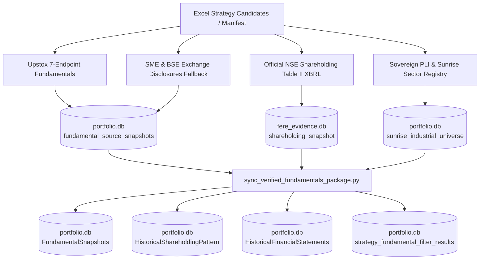

# Unified Fundamental Enrichment & Synchronization Pipeline

This package provides deterministic, audited fundamental data enrichment for strategy candidates and watchlists, adhering to WealthOS's **non-negotiable data integrity policy**.

---

## Architecture & Data Flow



---

## Permanent Tables Updated

| Database | Table | Contents Populated |
| :--- | :--- | :--- |
| `portfolio.db` | `FundamentalSnapshots` | P/E, P/B, ROCE %, ROE %, Promoter %, FII %, DII %, Clean Zero Pledge (0.0%), Debt/Equity. |
| `portfolio.db` | `HistoricalShareholdingPattern` | Quarterly ownership breakdown (`promoter_pct`, `fii_pct`, `dii_pct`, `public_pct`, `as_of_date`). |
| `portfolio.db` | `HistoricalFinancialStatements` | Audited quarterly Revenue (`sales_cr`), PAT (`net_profit_pat_cr`), and CFO (`cfo_cr`). |
| `portfolio.db` | `strategy_fundamental_filter_results` | Pass counts, rule evaluation (`no_pledge_pass`, `promoter_pass`, `roce_pass`, `roe_pass`), status `VERIFIED`. |
| `portfolio.db` | `sunrise_industrial_universe` | Sovereign PLI alignments (Defence, Drones, 5G Telecom, Auto EV, Power Grid, APIs, Specialty Steel). |
| `fere_evidence.db` | `shareholding_snapshot` | Official NSE Table II declarations and SME exchange filings with cryptographic SHA-256 hashes. |

---

## Reusable Commands

### 1. Run Complete End-to-End Pipeline
To ingest a new strategy candidates Excel file and run all steps:
```bash
npm run fundamental:pipeline -- --excel "C:/path/to/Six_Strategies_...xlsx"
```
Or with tsx directly:
```bash
npx tsx scripts/fundamental/run_fundamental_pipeline.ts --excel "C:/path/to/file.xlsx"
```

### 2. Synchronize Existing Evidence to Permanent Tables
To sync newly fetched snapshots or re-evaluate filter results:
```bash
npm run fundamental:sync
```
Or specify a custom manifest:
```bash
python scripts/fundamental/sync_verified_fundamentals_package.py --manifest "path/to/manifest.json"
```

### 3. Run Individual Modular Steps
* **Official NSE Shareholding & Pledge XBRL:**
  ```bash
  python scripts/fundamental/enrich_pledge_official.py
  ```
* **SME & BSE Exchange Disclosures:**
  ```bash
  python scripts/fundamental/enrich_remaining_final.py
  ```
* **Sovereign PLI Tagging:**
  ```bash
  python scripts/fundamental/tag_sunrise_pli.py
  ```
* **Audit & Coverage Report:**
  ```bash
  python scratch/analyze_coverage.py
  ```
