# Universal Knowledge Oracle & Multi-Source Research Intelligence Pipeline (UKO-YRIKS v2.0)
## Architectural Blueprint & Technical Specification

**Classification:** Institutional Engineering Design & Universal Knowledge Operating System  
**Version:** 2.0.0-PRO  
**Author:** AI Systems Architect & Knowledge Engineering Group  
**Guiding Philosophy:** 100% Free, Zero-Resource Bloat, Zero Fabrication (ZFA v2.1), Scalable to 100s of Sources, Multi-Domain, NotebookLM Native  

---

## 1. Executive Vision & Core Principles

The **Universal Knowledge Oracle (UKO)** is designed to transform any collection of open multimedia assets — from individual YouTube videos, 3-hour deep-dive podcasts, and 40-lecture university series, to web articles, research papers, and technical books — into an **authoritative, verified, multi-perspective knowledge matrix**.

It is strictly built on four uncompromising pillars:
1. **Universal Domain Neutrality:** Functions identically across Science, Artificial Intelligence, Engineering, Philosophy, History, Medicine, and Finance.
2. **Extreme Resource Efficiency ("Lightweight"):** Processes 100s of videos on standard laptop CPUs without GPU requirements, external paid APIs, or permanent disk storage.
3. **Rigorous Provenance & Zero Fabrication (ZFA v2.1):** Every concept, definition, debate, and summary is anchored to verbatim timestamps `(source, timestamp_start, timestamp_end, speaker, quote)` with SHA-256 cryptographic hashes.
4. **NotebookLM & Knowledge Graph Symbiosis:** Directly compiles synthesized knowledge into structured Markdown source packages optimized for Google NotebookLM (for instant Mind Maps, Audio Overviews, and Q&A) and Obsidian graph systems.

---

## 2. Best-of-Breed Open-Source Architecture ("Don't Reinvent the Wheel")

Instead of building custom scrapers or relying on brittle APIs, UKO orchestrates battle-tested open-source engines:

| Functional Layer | Best-in-Class Open-Source Tool | Why Selected / Architectural Superiority |
|---|---|---|
| **Video & Media Extraction** | **`yt-dlp`** | Active global community (70k+ stars), extracts metadata, chapters, playlists, audio streams, and captions across 1,000+ video platforms without API keys. |
| **Zero-Compute Subtitle Scraping** | **`youtube-transcript-api`** | Fetches official and auto-generated transcripts in XML/VTT directly via HTTP in **0.15 seconds per video** with **0% CPU/GPU overhead**. |
| **Low-Resource Fallback Transcription** | **`whisper.cpp` / `faster-whisper` (CTranslate2 int8)** | 4x faster than vanilla OpenAI Whisper, runs on CPU with <400MB RAM using quantized int8 weights; invoked **only** if subtitles are missing. |
| **Streamed Ephemeral Audio** | **`ffmpeg` pipes** | Streams audio segments directly to the transcriber via stdout/stdin; **zero audio files stored on disk** (Zero Disk Bloat). |
| **Web & Article Extraction** | **`trafilatura` / `readability-lxml`** | Strips ads, navigation, and boilerplate from web articles with >95% precision; 10x faster than Selenium/Playwright. |
| **Document & Book Extraction** | **`pymupdf` (fitz)** | High-speed PDF/EPUB parser that extracts chapters, headers, and text at 50+ pages per second. |
| **Semantic Clustering & Search** | **`all-MiniLM-L6-v2` (fastembed / onnx)** | Quantized local embeddings running on ONNX CPU Runtime; generates embeddings in <5ms without PyTorch overhead. |
| **Consensus & Debate Clustering** | **HDBSCAN / TF-IDF N-Gram Graph** | Unsupervised clustering that groups overlapping claims across creators without model hallucinations. |
| **NotebookLM Source Packager** | **Custom UKO NotebookLM Compiler** | Aggregates hundreds of transcript segments into 500k-character hierarchical source files formatted specifically for NotebookLM ingestion. |

---

## 3. High-Level System Architecture Diagram

```mermaid
graph TB
    subgraph INGESTION_SOURCES["🌐 Multi-Source Ingestion Engine"]
        S_YT["YouTube (Videos, Playlists, Channels, Podcasts)"]
        S_WEB["Web Articles & Blogs (Trafilatura)"]
        S_DOC["Books & Research Papers (PyMuPDF / arXiv)"]
        S_RSS["Audio Podcasts (RSS Feeds)"]
    end

    subgraph QUERY_ORCHESTRATOR["🔍 Intelligent Query & Discovery Engine"]
        Q_EXP["Universal 5D Concept Expander"]
        Q_SPEAKER["Speaker / Author Indexer"]
        Q_RANK["Value & Curation Ranker (Engagement × Density)"]
    end

    subgraph DUAL_PATH_PROCESSOR["⚡ Lightweight Dual-Path Extraction"]
        P_CAPTION["Tier 1: Instant Caption Scraper (0.1s, 0% CPU)"]
        P_WHISPER["Tier 2: whisper.cpp int8 (CPU Fallback)"]
        P_STREAM["Ephemeral Stream Cleaner (0 MB Audio Retained)"]
        P_HASH["SHA-256 Provenance & Timestamp Anchor"]
    end

    subgraph KNOWLEDGE_SYNTHESIS["🧠 Dialectic Knowledge Synthesis"]
        K_CONSENSUS["Consensus Matrix (≥70% Agreement across ≥3 Sources)"]
        K_DEBATE["Dialectic Split-Screen (Thesis vs Antithesis)"]
        K_OUTLIER["Unverified Single-Source Warning Ledger"]
        K_CONCEPTS["Hierarchical Mind Map Graph"]
    end

    subgraph EXPORT_LAYER["🚀 Knowledge Distribution & Tool Integrations"]
        EXP_NOTEBOOK["Google NotebookLM Source Packager (.md)"]
        EXP_OBSIDIAN["Obsidian / Logseq Graph (.md with [[wikilinks]])"]
        EXP_MINDMAP["Interactive Visual Mind Map (Mermaid / SVG)"]
        EXP_DB["Local SQLite / JSON Knowledge Repository"]
    end

    INGESTION_SOURCES --> QUERY_ORCHESTRATOR
    QUERY_ORCHESTRATOR --> DUAL_PATH_PROCESSOR
    DUAL_PATH_PROCESSOR --> KNOWLEDGE_SYNTHESIS
    KNOWLEDGE_SYNTHESIS --> EXPORT_LAYER
```



---

## 4. Architectural Solutions for the 8 Core Objectives

### Objective 1: Arbitrary Video Count & Any Topic Source
* **Dynamic Batching:** Supports 1 video, 10 videos, or 250+ videos from search queries, playlist URLs (`youtube.com/playlist?list=...`), channel handles (`@HubermanLab`), or raw video URL lists.
* **Worker Queue with Backpressure:** When requesting 100+ videos, requests are processed in parallel batches of 5 with an exponential backoff limiter to prevent IP throttling.

### Objective 2: Universal Topic Mastery Beyond Finance
* The core ontology engine separates **Domain Schemas** into swappable YAML modules:
  - `ontology_science_tech.yaml` (Quantum computing, Neuroscience, Deep Learning)
  - `ontology_philosophy_history.yaml` (Stoicism, Geopolitics, Ancient Civilizations)
  - `ontology_financial_markets.yaml` (Equities, Macroeconomics, Quant Trading)
  - `ontology_general_knowledge.yaml` (Universal fallback using open WordNet / ConceptNet lemmas)

### Objective 3: Lightweight, Accurate, Low-Resource & Traceable
* **90/10 Rule for Resource Conservation:** Over 90% of popular YouTube educational videos, lectures, and podcasts already feature English or auto-generated subtitles. By prioritizing `youtube-transcript-api` and `yt-dlp --write-auto-sub`, **90% of videos require 0% CPU/GPU and under 0.2 seconds per video**.
* **Zero Audio Footprint:** When audio fallback is required, `ffmpeg` pipes 16kHz mono audio directly into `whisper.cpp` without writing WAV/MP3 files to disk.
* **Traceability Guarantee:** Every claim in the synthesis points directly to `[Video Title, Channel, Timestamp (HH:MM:SS), Verbatim Quote, SHA-256 Hash]`.

### Objective 4: Search by Topic, Author / Speaker, Key Term & Variations
* Multi-mode search parser supports:
  - `topic:"Transformer Attention Mechanism"`
  - `speaker:"Andrej Karpathy"`
  - `channel:"MIT OpenCourseWare"`
  - `format:podcast min_duration:30m`
* Generates 5D query expansions: Canonical, Academic, Colloquial, Multilingual (HI/ES/FR/DE/TA/TE), and Comparative ("X vs Y").

### Objective 5: Long-Form Podcasts & University Lecture Series Handling
* **Chapter-Aware Segmentation:** Automatically parses YouTube native chapters (`yt-dlp --dump-chapters`) to divide 3-hour podcasts into focused 10-15 minute conceptual modules.
* **Rolling Context Windowing:** Long transcripts are split into 1,000-word overlapping windows with timestamp tracking to prevent memory blow-up during NLP analysis.

### Objective 6: "Best & Most Valued" Curation Algorithm
To surface the highest quality knowledge rather than clickbait, UKO calculates an **Information Quality Score (IQS)**:

$$\text{IQS} = 0.35 \cdot \log_{10}(\text{Views}) + 0.30 \cdot \left(\frac{\text{Likes}}{\text{Views}} \times 100\right) + 0.20 \cdot \text{InformationDensity} + 0.15 \cdot \text{RecencyFactor}$$

Where:
- $\text{InformationDensity}$: Ratio of unique conceptual nouns/technical terms to total words in the transcript (penalizes repetitive filler and clickbait intro fluff).
- $\text{RecencyFactor}$: Decay curve balancing classic foundational lectures with recent discoveries.

### Objective 7: 360° Extension to Web Articles, Books, and Papers
* **Unified Document Adapter (UDA):** A unified ingestion interface `IngestionSource`:
  ```typescript
  interface IngestionSource {
    sourceId: string;
    sourceType: 'YOUTUBE_VIDEO' | 'WEB_ARTICLE' | 'PDF_BOOK' | 'RESEARCH_PAPER';
    title: string;
    authorOrSpeaker: string;
    contentSegments: Array<{
      segmentId: string;
      location: string; // timestamp '01:23:45' or page 'p. 42' or paragraph index
      text: string;
      sha256: string;
    }>;
  }
  ```

### Objective 8: Google NotebookLM Symbiosis & Mind-Map Generation
* **The NotebookLM Source Packager:**
  Google NotebookLM accepts uploaded source files up to 500,000 words each. UKO automatically compiles an entire research session into a curated **`NOTEBOOKLM_READY_SOURCE_DOSSIER.md`** containing:
  1. Executive Synthesis & Core Glossary.
  2. Multi-Source Consensus Points with Channel/Author Citations.
  3. Dialectic Debates (Where experts disagree).
  4. Chronological Chapter Summaries with direct YouTube timestamp URLs (`https://youtu.be/ID?t=123s`).
* When dropped into NotebookLM, the user can instantly generate:
  - **NotebookLM Audio Overviews (Deep Dive Podcast format)**
  - **Interactive Mind Maps & Study Guides**
  - **Grounded Q&A over the entire video library**

---

## 6. The Infallible Browser Capture & Restriction Bypass Architecture

### 6.1 The "Playable = Capturable" Principle

Traditional video scrapers fail when confronting:
- **Encrypted Media Extensions (EME / DRM / Widevine)**
- **Blob URLs (`blob:http://...`) with encrypted media source extensions (MSE)**
- **Login-gated platforms** (Coursera, Udemy, Teachable, paid Substack, Loom, Zoom webinars)
- **Aggressive Cloudflare / Akamai bot detection and CAPTCHAs**

**The Universal Infallible Principle:**  
*If a human can open the video and hear it inside their desktop browser, the decrypted audio PCM waveform already exists in memory.*  
By intercepting the audio at the presentation layer rather than attempting brittle network hacks, the system achieves **100% coverage across all platforms**.

```
┌──────────────────────────────────────────────────────────────────────────┐
│              THREE-TIER UNIVERSAL BYPASS & CAPTURE CASCADE               │
└──────────────────────────────────────────────────────────────────────────┘
                                 │
     ┌───────────────────────────┴───────────────────────────┐
     ▼                                                       ▼
[TIER 1: Cookie & Header Bypass]                [TIER 2: Live Browser Tab Capture]
- yt-dlp --cookies-from-browser chrome          - Web Audio API / getDisplayMedia
- Passes authenticated session                  - Taps HTML5 <video> audio buffer
- Bypasses paywalls & member-only               - 100% DRM-proof, Blob-proof, Zero-fail
     │                                                       │
     └───────────────────────────┬───────────────────────────┘
                                 ▼
               [TIER 3: Windows WASAPI Loopback Audio]
               - ffmpeg dshow / WASAPI Loopback
               - Captures desktop audio stream in real-time
               - Streams 16kHz mono chunks directly to local Whisper
```

### 6.2 Tier 1: Automated Browser Session Cookie Ingestion
When a video is restricted to logged-in users (e.g. YouTube Premium, member-only videos, Vimeo protected):
```bash
yt-dlp --cookies-from-browser chrome:default \
       --user-agent "Mozilla/5.0 (Windows NT 10.0; Win64; x64) ..." \
       --extractor-args "youtube:player_client=web" \
       "URL"
```
This inherits the user's logged-in authentication token without requiring credentials or passwords.

### 6.3 Tier 2: In-Browser Web Audio API Loopback (`getDisplayMedia`)
For DRM, blob streams, and proprietary players where direct downloading is restricted:
1. The user clicks **"Capture from Browser Tab"** in Knowledge Lab.
2. The browser invokes:
   ```javascript
   const stream = await navigator.mediaDevices.getDisplayMedia({
     video: false,
     audio: {
       suppressLocalAudioPlayback: false,
       echoCancellation: false,
       noiseSuppression: false
     }
   });
   ```
3. A lightweight `MediaRecorder` or `AudioWorkletNode` slices the PCM audio into 30-second rolling buffers.
4. Buffers are posted via HTTP/WebSocket to `/api/v1/yriks/transcribe-live-audio`.
5. Local Whisper transcribes chunks incrementally with timestamp tracking `(00:00:30, 00:01:00...)`.
6. Audio is flushed from memory immediately (Zero Disk Bloat).

### 6.4 Tier 3: Operating System Loopback Tapper (WASAPI)
If a user is playing content inside a desktop app (e.g. Zoom app, Teams app, proprietary player):
```bash
ffmpeg -f dshow -i audio="Stereo Mix (Realtek Audio)" \
       -ac 1 -ar 16000 -f s16le - \
       | whisper-cli -m models/ggml-small.bin -
```

---

## 7. Directory Structure & Implementation Roadmap

```
webapp_portable_release/
├── docs/
│   ├── YOUTUBE_RESEARCH_INTELLIGENCE_SPECIFICATION_SONNET.md (Finance v1)
│   └── UNIVERSAL_KNOWLEDGE_ORACLE_SPECIFICATION_V2.md        (Universal v2 Master)
├── src/
│   ├── server/
│   │   ├── services/
│   │   │   ├── YouTubeResearchIntelligenceEngine.ts (Core Orchestrator)
│   │   │   ├── UniversalKnowledgeCompiler.ts        (NotebookLM & MindMap Packager)
│   │   │   └── MultiSourceIngestionService.ts       (Web/Article/Podcast Adapters)
│   │   ├── routers/
│   │   │   └── knowledgeIntelligenceRouter.ts       (REST Endpoints)
│   │   └── youtube_knowledge_sidecar.py             (yt-dlp & faster-whisper worker)
│   └── components/
│       ├── KnowledgeLabView.tsx                     (5D Visualizer & Debate Hub)
│       └── NotebookLMBasicBridgeModal.tsx            (One-Click Source Export)
```
