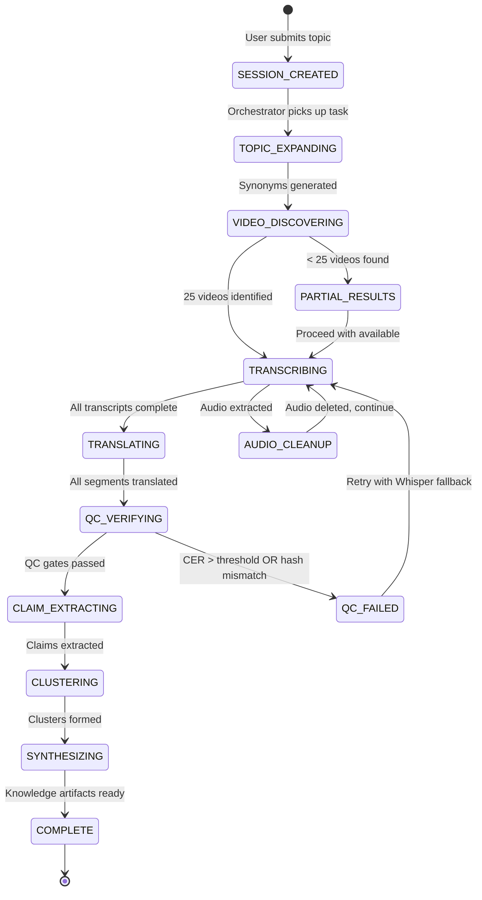

# NRI WealthOS — YouTube Research Intelligence & Knowledge Synthesis Pipeline
## Exhaustive Architectural Design & Detailed Technical Specification

**Document Classification:** Institutional Engineering Artifact — Architecture & Design Phase  
**Version:** 1.0.0-ARCH  
**Status:** Pre-Implementation Design Specification  
**Authored By:** Principal AI Systems Architect & Lead Quantitative Software Engineer, NRI WealthOS  
**Compliance Framework:** Zero Fabrication Architecture (ZFA) v2.1  
**Date:** 2025  

---

## Table of Contents

1. [Executive Summary & Design Philosophy](#1-executive-summary--design-philosophy)
2. [System Architecture & Component Diagram](#2-system-architecture--component-diagram)
3. [Topic Expansion & Semantic Synonym Generation Engine](#3-topic-expansion--semantic-synonym-generation-engine)
4. [Free-Tier Ingestion & Video Scraping Pipeline](#4-free-tier-ingestion--video-scraping-pipeline)
5. [Dual-Path Transcription & Audio Lifecycle Pipeline](#5-dual-path-transcription--audio-lifecycle-pipeline)
6. [Open-Source Translation & Multi-Lingual Normalization Pipeline](#6-open-source-translation--multi-lingual-normalization-pipeline)
7. [Quality Control & Anti-Fabrication Verification Engine](#7-quality-control--anti-fabrication-verification-engine)
8. [Semantic Claim Extraction, Clustering & Debate Matrix Engine](#8-semantic-claim-extraction-clustering--debate-matrix-engine)
9. [Knowledge & Feature Synthesis Engine](#9-knowledge--feature-synthesis-engine)
10. [Database Schema Design](#10-database-schema-design)
11. [REST API Specification](#11-rest-api-specification)
12. [Frontend UI/UX Blueprint](#12-frontend-uiux-blueprint)
13. [Edge Cases, Failure Modes & Remediation](#13-edge-cases-failure-modes--remediation)
14. [Dependency Manifest & Zero-Cost Compliance Matrix](#14-dependency-manifest--zero-cost-compliance-matrix)
15. [Implementation Sequencing & Phase Roadmap](#15-implementation-sequencing--phase-roadmap)

---

## 1. Executive Summary & Design Philosophy

### 1.1 Purpose Statement

The **YouTube Research Intelligence & Knowledge Synthesis Pipeline** (hereafter **YRIKS**) is a fully self-hosted, zero-cost, institutionally rigorous intelligence extraction system embedded within NRI WealthOS. It transforms raw YouTube video content — spanning financial analysis, market commentary, sector research, and investment discourse — into structured, cryptographically verified, bias-annotated, multi-source consensus knowledge artifacts that directly feed the NRI WealthOS decision-support layer.

### 1.2 Zero Fabrication Architecture (ZFA) Mandate

Every design decision in YRIKS is governed by the ZFA mandate:

| ZFA Principle | YRIKS Implementation |
|---|---|
| **No Hallucination** | Every claim grounded to `(videoId, timestamp_start, timestamp_end, channel_name)` — no inference without citation |
| **No Fabrication** | Raw transcript preserved verbatim with SHA-256 hash; no paraphrasing without provenance chain |
| **No Stale Data** | Session timestamps, video publish dates, and ingestion timestamps recorded on every artifact |
| **No Single-Source Trust** | Claims from single videos flagged `[UNVERIFIED_SINGLE_SOURCE]`; consensus requires ≥70% agreement across ≥3 sources |
| **No Bias Amplification** | Automated sensationalism/hyperbole detection; structural debate matrix forces opposing views |
| **No Cost Leakage** | 100% open-source, locally executed stack; zero external API calls for core pipeline |

### 1.3 Core Design Constraints Summary

```
┌─────────────────────────────────────────────────────────────────┐
│                    YRIKS DESIGN CONSTRAINTS                     │
├─────────────────────────────────────────────────────────────────┤
│  Cost Model        : ZERO — 100% free/open-source only          │
│  Search Scale      : Top 25 videos per topic (configurable)     │
│  Transcription     : Caption-first → Whisper-small fallback     │
│  Audio Lifecycle   : Ephemeral — deleted post-transcription      │
│  Languages         : EN, HI, TA, TE, GU, MR + auto-detect      │
│  Translation       : Local offline models only                  │
│  Integrity         : SHA-256 on all artifacts                   │
│  Claim Grounding   : 100% timestamp-anchored                    │
│  Consensus Gate    : ≥70% agreement, ≥3 independent sources     │
│  Deployment        : Self-hosted, CPU/GPU agnostic              │
└─────────────────────────────────────────────────────────────────┘
```

---

## 2. System Architecture & Component Diagram

### 2.1 High-Level System Architecture (Mermaid)

```mermaid
graph TB
    subgraph UI_LAYER["🖥️ Frontend Layer — Knowledge Lab Tab"]
        UI_HUB["Research Intelligence Hub"]
        UI_RADAR["Video Radar Grid"]
        UI_CONSENSUS["Consensus Matrix View"]
        UI_DEBATE["Debate Split-Screen"]
        UI_FEATURE["Feature Pipeline Board"]
        UI_PROVENANCE["Provenance Ledger Viewer"]
        UI_LOOPBACK["Universal Browser Tab Loopback Tapper"]
    end

    subgraph API_LAYER["⚡ REST API Gateway Layer"]
        API_GW["FastAPI Gateway\n/api/v1/yriks/*"]
        TASK_Q["Celery Task Queue\n(Redis Broker)"]
        PROGRESS["SSE Progress Stream\n/api/v1/yriks/progress/{session_id}"]
    end

    subgraph ORCHESTRATION["🎯 Pipeline Orchestration Layer"]
        ORCH["Session Orchestrator\nyriks.orchestrator"]
        STATE["Pipeline State Machine\n(PENDING→RUNNING→COMPLETE→FAILED)"]
    end

    subgraph TOPIC_ENGINE["🔍 Topic Expansion Engine"]
        SEED["Seed Query Parser"]
        ONTOLOGY["Financial Domain Ontology\n(NSE/BSE/MF/ETF/Macro)"]
        SYNONYM["Synonym & Ticker Expander"]
        QUERY_GEN["Search Query Generator\n(25 queries × N topics)"]
    end

    subgraph INGESTION["📥 Ingestion & Discovery Pipeline"]
        YT_SEARCH["yt-dlp Search Engine\nytsearch25:query"]
        META_EXT["Metadata Extractor\n(title, channel, date, duration, views)"]
        DEDUP["Deduplication Filter\n(videoId hash set)"]
        RATE_LIM["Rate Limiter\n(exponential backoff)"]
        COOKIE_BYPASS["Browser Cookie Ingestion\n--cookies-from-browser"]
        TAB_LOOPBACK["Live Browser Tab Audio Loopback\n(navigator.mediaDevices.getDisplayMedia)"]
    end

    subgraph TRANSCRIPTION["📝 Dual-Path Transcription Pipeline"]
        CAPTION_CHECK["Caption Availability Probe"]
        VTT_PARSER["VTT/SRT Caption Parser\n(Path A — Primary)"]
        AUDIO_EXT["Audio Extractor\nyt-dlp → opus/m4a"]
        WHISPER["faster-whisper\nsmall model (Path B — Fallback)"]
        AUDIO_GC["Audio Garbage Collector\n(immediate deletion)"]
        TRANSCRIPT_MERGE["Transcript Normalizer\n& Segment Builder"]
    end

    subgraph TRANSLATION["🌐 Multi-Lingual Translation Pipeline"]
        LANG_DETECT["Language Detector\nlangdetect / lingua"]
        CHUNKER["Semantic Chunker\n(512-token windows)"]
        ARGOS["Argos Translate\n(offline model inference)"]
        BILINGUAL["Bilingual Segment Builder\n(original + translated + provenance)"]
    end

    subgraph QC_ENGINE["🔒 Quality Control & ZFA Verification Engine"]
        SHA256["SHA-256 Integrity Hasher"]
        LEV_CROSS["Levenshtein Cross-Validator\n(Caption vs Whisper CER)"]
        ANTI_HALL["Anti-Hallucination Gate\n(grounding verifier)"]
        BIAS_DET["Bias & Hyperbole Detector\n(regex + ML classifier)"]
        QC_LEDGER["QC Audit Ledger"]
    end

    subgraph CLAIM_ENGINE["⚗️ Claim Extraction & Clustering Engine"]
        CLAIM_EXT["Atomic Claim Extractor\n(spaCy NLP pipeline)"]
        VECTORIZER["Sentence Vectorizer\n(sentence-transformers\nall-MiniLM-L6-v2)"]
        CLUSTER["HDBSCAN Claim Clusterer"]
        CONSENSUS["Consensus Scorer\n(≥70% threshold)"]
        DEBATE_MAT["Debate Matrix Builder\n(thesis ↔ antithesis)"]
    end

    subgraph SYNTHESIS["💡 Knowledge & Feature Synthesis Engine"]
        KNOW_SYNTH["Knowledge Synthesizer\n(unbiased summary builder)"]
        FEAT_PROP["Feature Proposal Generator\n(screening rules, signals)"]
        CONF_SCORE["Confidence Scorer\n(source count × consensus %)"]
        PROV_LEDGER["Provenance Ledger\n(full citation chain)"]
    end

    subgraph STORAGE["🗄️ Persistence Layer"]
        SQLITE["SQLite Database\nyriks_knowledge.db"]
        CACHE["Redis Cache\n(session state, progress)"]
        HASH_STORE["SHA-256 Hash Store\n(integrity verification)"]
    end

    UI_LAYER --> API_LAYER
    API_LAYER --> ORCHESTRATION
    ORCHESTRATION --> TOPIC_ENGINE
    TOPIC_ENGINE --> INGESTION
    INGESTION --> TRANSCRIPTION
    TRANSCRIPTION --> TRANSLATION
    TRANSLATION --> QC_ENGINE
    QC_ENGINE --> CLAIM_ENGINE
    CLAIM_ENGINE --> SYNTHESIS
    SYNTHESIS --> STORAGE
    STORAGE --> API_LAYER
    QC_ENGINE --> STORAGE
```



### 2.2 Detailed Component Interaction Diagram (ASCII)

```
╔══════════════════════════════════════════════════════════════════════════════════╗
║                    YRIKS PIPELINE — COMPONENT INTERACTION MAP                  ║
╠══════════════════════════════════════════════════════════════════════════════════╣
║                                                                                  ║
║  USER INPUT                                                                      ║
║  ┌─────────────────────────────────────────────────────────────────────────┐    ║
║  │  Topic: "Nifty 50 ETF"  │  Depth: 25 videos  │  Languages: Auto        │    ║
║  └──────────────────────────────────┬──────────────────────────────────────┘    ║
║                                     │                                            ║
║                                     ▼                                            ║
║  ┌──────────────────────────────────────────────────────────────────────────┐   ║
║  │                    STAGE 1: TOPIC EXPANSION ENGINE                       │   ║
║  │  Input: "Nifty 50 ETF"                                                   │   ║
║  │  Output: ["Nifty 50 ETF", "NIFTYBEES", "Nippon India ETF Nifty 50",     │   ║
║  │           "index fund India", "निफ्टी 50 ईटीएफ", "passive investing",   │   ║
║  │           "NSE index tracker", "NIFTY ETF review", ...]                  │   ║
║  │  Method: Ontology lookup + BM25 synonym expansion + ticker mapping       │   ║
║  └──────────────────────────────────┬─────────────────────────────────────-┘   ║
║                                     │                                            ║
║                                     ▼                                            ║
║  ┌──────────────────────────────────────────────────────────────────────────┐   ║
║  │                    STAGE 2: VIDEO DISCOVERY & INGESTION                  │   ║
║  │  Tool: yt-dlp (ytsearch25:query for each expanded query)                 │   ║
║  │  Dedup: videoId hash set (cross-query deduplication)                     │   ║
║  │  Rate: 2s base delay, exponential backoff on 429/503                     │   ║
║  │  Output: Up to 25 unique videos with full metadata                       │   ║
║  └──────────────────────────────────┬─────────────────────────────────────-┘   ║
║                                     │                                            ║
║                                     ▼                                            ║
║  ┌──────────────────────────────────────────────────────────────────────────┐   ║
║  │                    STAGE 3: DUAL-PATH TRANSCRIPTION                      │   ║
║  │                                                                           │   ║
║  │   ┌─────────────────────┐         ┌──────────────────────────────────┐   │   ║
║  │   │   PATH A (Primary)  │         │      PATH B (Fallback)           │   │   ║
║  │   │  Caption Available? │──YES──▶ │  Download VTT/SRT                │   │   ║
║  │   │                     │         │  Parse timestamps                │   │   ║
║  │   │                     │──NO───▶ │  Extract audio (opus)            │   │   ║
║  │   │                     │         │  faster-whisper small            │   │   ║
║  │   │                     │         │  DELETE audio immediately        │   │   ║
║  │   └─────────────────────┘         └──────────────────────────────────┘   │   ║
║  │                                                                           │   ║
║  │   Cross-validation: If both paths available → CER calculation            │   ║
║  └──────────────────────────────────┬─────────────────────────────────────-┘   ║
║                                     │                                            ║
║                                     ▼                                            ║
║  ┌──────────────────────────────────────────────────────────────────────────┐   ║
║  │                    STAGE 4: TRANSLATION & NORMALIZATION                  │   ║
║  │  Detect: langdetect/lingua per segment                                   │   ║
║  │  Translate: Argos Translate (offline) → English canonical form           │   ║
║  │  Preserve: original_text + translated_text + lang_code + model_version   │   ║
║  └──────────────────────────────────┬─────────────────────────────────────-┘   ║
║                                     │                                            ║
║                                     ▼                                            ║
║  ┌──────────────────────────────────────────────────────────────────────────┐   ║
║  │                    STAGE 5: QC & ZFA VERIFICATION                        │   ║
║  │  SHA-256: raw_transcript, translated_segments, extraction_payload        │   ║
║  │  Levenshtein: CER between caption and whisper (sample 10% of segments)   │   ║
║  │  Bias Detection: regex patterns + ML classifier                          │   ║
║  │  Grounding Check: every claim must have (videoId, ts_start, ts_end)      │   ║
║  └──────────────────────────────────┬─────────────────────────────────────-┘   ║
║                                     │                                            ║
║                                     ▼                                            ║
║  ┌──────────────────────────────────────────────────────────────────────────┐   ║
║  │                    STAGE 6: CLAIM EXTRACTION & CLUSTERING                │   ║
║  │  Extract: spaCy NLP → atomic financial claims                            │   ║
║  │  Vectorize: sentence-transformers all-MiniLM-L6-v2                       │   ║
║  │  Cluster: HDBSCAN (min_cluster_size=3)                                   │   ║
║  │  Consensus: ≥70% agreement across ≥3 sources → VERIFIED_CONSENSUS        │   ║
║  │  Debate: thesis ↔ antithesis matrix per topic cluster                    │   ║
║  └──────────────────────────────────┬─────────────────────────────────────-┘   ║
║                                     │                                            ║
║                                     ▼                                            ║
║  ┌──────────────────────────────────────────────────────────────────────────┐   ║
║  │                    STAGE 7: SYNTHESIS & FEATURE PROPOSALS                │   ║
║  │  Knowledge Summary: unbiased, multi-source, provenance-anchored          │   ║
║  │  Feature Proposals: screening rules, signals, risk params                │   ║
║  │  Confidence Score: f(source_count, consensus_pct, recency_weight)        │   ║
║  └──────────────────────────────────┬─────────────────────────────────────-┘   ║
║                                     │                                            ║
║                                     ▼                                            ║
║  ┌──────────────────────────────────────────────────────────────────────────┐   ║
║  │                    STAGE 8: PERSISTENCE & API SERVING                    │   ║
║  │  SQLite: full artifact storage with referential integrity                │   ║
║  │  Redis: session state, progress streaming                                │   ║
║  │  FastAPI: REST endpoints for UI consumption                              │   ║
║  └──────────────────────────────────────────────────────────────────────────┘   ║
╚══════════════════════════════════════════════════════════════════════════════════╝
```

### 2.3 Data Flow & State Machine



---

## 3. Topic Expansion & Semantic Synonym Generation Engine

### 3.1 Design Rationale

A naive single-query search for "Nifty 50 ETF" would miss videos titled "NIFTYBEES review", "निफ्टी इंडेक्स फंड", "passive investing India 2024", or "NSE tracker fund comparison". The Topic Expansion Engine ensures 360-degree coverage by systematically expanding any seed query across five orthogonal dimensions.

### 3.2 Five-Dimensional Expansion Framework

```
┌─────────────────────────────────────────────────────────────────────────┐
│              TOPIC EXPANSION — 5-DIMENSIONAL FRAMEWORK                  │
├─────────────────────────────────────────────────────────────────────────┤
│                                                                          │
│  DIMENSION 1: TICKER & INSTRUMENT CODES                                 │
│  ─────────────────────────────────────                                  │
│  Input: "Nifty 50 ETF"                                                  │
│  Output: NIFTYBEES, JUNIORBEES, SETFNIF50, ICICINIFTY, HDFCNIFTY50     │
│  Source: NSE/BSE symbol lookup table (static JSON, updated quarterly)   │
│                                                                          │
│  DIMENSION 2: CANONICAL SYNONYMS & ALTERNATE NAMES                      │
│  ──────────────────────────────────────────────────                     │
│  Input: "Nifty 50 ETF"                                                  │
│  Output: "index fund", "passive fund", "tracker fund",                  │
│          "exchange traded fund India", "NSE 50 fund"                    │
│  Source: Financial domain ontology (YAML knowledge graph)               │
│                                                                          │
│  DIMENSION 3: MULTI-LINGUAL VARIANTS                                    │
│  ──────────────────────────────────                                     │
│  Input: "Nifty 50 ETF"                                                  │
│  Output: "निफ्टी 50 ईटीएफ" (Hindi), "நிஃப்டி 50 ETF" (Tamil),         │
│          "నిఫ్టీ 50 ETF" (Telugu), "નિફ્ટી 50 ETF" (Gujarati)          │
│  Source: Pre-built translation lookup table (static, curated)           │
│                                                                          │
│  DIMENSION 4: CONTEXTUAL JARGON & COLLOQUIAL TERMS                      │
│  ─────────────────────────────────────────────────                      │
│  Input: "Nifty 50 ETF"                                                  │
│  Output: "index investing", "buy the index", "market cap weighted",     │
│          "SIP in ETF", "demat ETF", "zero expense ratio fund"           │
│  Source: Curated jargon corpus (financial YouTube vocabulary)           │
│                                                                          │
│  DIMENSION 5: TEMPORAL & COMPARATIVE QUALIFIERS                         │
│  ──────────────────────────────────────────────                         │
│  Input: "Nifty 50 ETF"                                                  │
│  Output: "Nifty 50 ETF 2024", "best Nifty ETF comparison",             │
│          "Nifty ETF vs index fund", "Nifty ETF returns analysis"        │
│  Source: Template-based query augmentation                              │
│                                                                          │
└─────────────────────────────────────────────────────────────────────────┘
```

### 3.3 Financial Domain Ontology Structure

```yaml
# financial_domain_ontology.yaml
# YRIKS Topic Expansion Ontology v1.0
# Covers: Equities, Mutual Funds, ETFs, Macro, Derivatives, Fixed Income

ontology:
  
  equity_indices:
    canonical: "Nifty 50"
    tickers: ["NIFTYBEES", "SETFNIF50", "ICICINIFTY", "HDFCNIFTY50", "KOTAKNIFTY"]
    synonyms: ["NSE 50", "Nifty index", "large cap index India", "blue chip index"]
    colloquial: ["nifty", "the index", "fifty stocks", "top 50 India"]
    hindi: ["निफ्टी 50", "निफ्टी इंडेक्स"]
    tamil: ["நிஃப்டி 50"]
    telugu: ["నిఫ్టీ 50"]
    gujarati: ["નિફ્ટી 50"]
    marathi: ["निफ्टी 50"]
    related_concepts: ["sensex", "nifty_next_50", "nifty_midcap", "passive_investing"]

  mutual_funds:
    canonical: "Mutual Fund"
    subcategories:
      - large_cap_fund
      - mid_cap_fund
      - small_cap_fund
      - flexi_cap_fund
      - elss_fund
      - debt_fund
      - hybrid_fund
      - index_fund
    synonyms: ["MF", "SIP fund", "AMFI fund", "NAV fund"]
    colloquial: ["mutual fund mein invest", "SIP karo", "fund house"]
    hindi: ["म्यूचुअल फंड", "निवेश फंड"]
    regulatory_bodies: ["SEBI", "AMFI", "CAMS", "KFintech"]

  etf:
    canonical: "ETF"
    full_form: "Exchange Traded Fund"
    synonyms: ["exchange traded fund", "index ETF", "gold ETF", "sectoral ETF"]
    tickers_gold: ["GOLDBEES", "SGOLD", "AXISGOLD", "HDFCGOLD"]
    tickers_equity: ["NIFTYBEES", "JUNIORBEES", "BANKBEES", "ITBEES"]
    colloquial: ["ETF kya hai", "ETF vs index fund", "demat mein ETF"]

  valuation_metrics:
    canonical: "P/E Ratio"
    synonyms: ["price to earnings", "PE multiple", "earnings multiple", "valuation ratio"]
    related: ["P/B ratio", "EV/EBITDA", "PEG ratio", "dividend yield", "ROE", "ROCE"]
    hindi: ["पी/ई अनुपात", "मूल्यांकन"]
    colloquial: ["PE kitna hai", "overvalued", "undervalued", "cheap stock", "expensive stock"]

  macro_india:
    canonical: "Indian Economy"
    synonyms: ["India GDP", "Indian market", "Bharat economy", "emerging market India"]
    indicators: ["RBI repo rate", "CPI inflation India", "IIP data", "FII DII flow",
                 "rupee dollar", "USDINR", "current account deficit", "fiscal deficit"]
    hindi: ["भारतीय अर्थव्यवस्था", "भारत की जीडीपी"]
    colloquial: ["India growth story", "China plus one", "Make in India", "PLI scheme"]

  risk_concepts:
    canonical: "Investment Risk"
    synonyms: ["market risk", "volatility", "drawdown", "standard deviation", "beta"]
    colloquial: ["risk kitna hai", "safe investment", "guaranteed returns", "loss ho sakta hai"]
    bias_triggers: ["guaranteed", "100% safe", "never lose", "sure shot", "risk-free"]

  query_templates:
    temporal: ["{topic} 2024", "{topic} 2025", "{topic} latest", "{topic} this year"]
    comparative: ["{topic} vs {related}", "best {topic}", "{topic} comparison", "{topic} review"]
    educational: ["{topic} explained", "{topic} kya hai", "how to invest in {topic}",
                  "{topic} for beginners", "{topic} analysis"]
    critical: ["{topic} problems", "{topic} risks", "{topic} disadvantages",
               "why not {topic}", "{topic} scam", "{topic} overrated"]
```

### 3.4 Expansion Algorithm — Pseudocode

```
ALGORITHM: TopicExpansionEngine.expand(seed_query: str) → List[SearchQuery]

INPUT:  seed_query = "Nifty 50 ETF"
OUTPUT: expanded_queries = [SearchQuery(text, weight, dimension, language)]

PROCEDURE:
  1. NORMALIZE seed_query
     a. Lowercase, strip punctuation
     b. Tokenize into concept_tokens = ["nifty", "50", "etf"]
     c. Identify entity_type via ontology lookup → entity_type = "etf"

  2. ONTOLOGY LOOKUP
     a. Load financial_domain_ontology.yaml
     b. Find matching node: ontology.etf + ontology.equity_indices
     c. Extract: tickers[], synonyms[], colloquial[], multilingual{}

  3. DIMENSION 1 — TICKER EXPANSION
     For each ticker in matched_node.tickers:
       queries.append(SearchQuery(
         text=ticker,
         weight=0.9,
         dimension="TICKER",
         language="en"
       ))

  4. DIMENSION 2 — SYNONYM EXPANSION
     For each synonym in matched_node.synonyms:
       queries.append(SearchQuery(
         text=f"{synonym} India",
         weight=0.85,
         dimension="SYNONYM",
         language="en"
       ))

  5. DIMENSION 3 — MULTILINGUAL EXPANSION
     For each (lang_code, translated_term) in matched_node.multilingual:
       queries.append(SearchQuery(
         text=translated_term,
         weight=0.80,
         dimension="MULTILINGUAL",
         language=lang_code
       ))

  6. DIMENSION 4 — COLLOQUIAL EXPANSION
     For each term in matched_node.colloquial:
       queries.append(SearchQuery(
         text=term,
         weight=0.75,
         dimension="COLLOQUIAL",
         language="mixed"
       ))

  7. DIMENSION 5 — TEMPLATE EXPANSION
     For each template in query_templates.temporal + query_templates.comparative
                        + query_templates.educational + query_templates.critical:
       expanded = template.format(topic=seed_query, related=related_concepts[0])
       queries.append(SearchQuery(
         text=expanded,
         weight=0.70,
         dimension="TEMPORAL_COMPARATIVE",
         language="en"
       ))

  8. DEDUPLICATION
     queries = deduplicate_by_normalized_text(queries)

  9. PRIORITIZATION
     queries.sort(key=lambda q: q.weight, descending=True)
     queries = queries[:MAX_QUERIES_PER_SESSION]  # configurable, default 50

  10. RETURN queries

COMPLEXITY: O(N_ontology_nodes × N_templates) — bounded by ontology size
EXPECTED OUTPUT SIZE: 30–60 unique queries for a typical financial topic
```

### 3.5 Seed Query Parser — Entity Recognition Rules

```
ENTITY RECOGNITION RULES (Priority Order):

Rule 1: NSE/BSE Ticker Pattern
  Regex: ^[A-Z]{2,10}(BEES|ETF|FUND|50|100|200)?$
  Example: "NIFTYBEES" → entity_type=ETF, exchange=NSE

Rule 2: ISIN Pattern
  Regex: ^IN[A-Z0-9]{10}$
  Example: "INF204KB14I2" → entity_type=MF_SCHEME

Rule 3: Fund House + Category Pattern
  Regex: (HDFC|ICICI|SBI|Axis|Kotak|Mirae|Nippon|UTI|DSP|Tata)\s