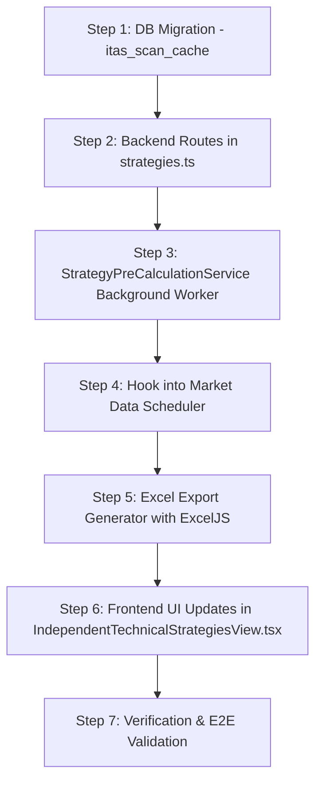

# ITAS (Independent Technical Analysis Engine) Architecture & Upgrade Specification
**Target Systems:** Strategy Selector UI, Background Pre-Calculation Daemon, Performance Acceleration & Offline Excel Export  
**Target Audience:** Autonomous Development Agent / Senior Full-Stack Engineer  
**Status:** APPROVED FOR IMPLEMENTATION (Specification Phase)  
**Workspace:** `c:\Users\gopal\OneDrive\Desktop\tesr\webapp_portable_release`  

---

## 1. Executive Summary & Goals

The Independent Technical Analysis Engine (ITAS) currently suffers from four operational bottlenecks:
1. **Incomplete Strategy Visibility & Selection:** The sidebar checkbox selector defaults to only 4 strategies (`.slice(0, 4)`) and does not cleanly separate built-in presets (10 catalog strategies) from user-created custom strategies.
2. **Synchronous Scanning Latency:** Users must manually click "Run Scan", causing the client to wait for a synchronous scan over a universe of **3,571 tickers**.
3. **Absence of Background Pre-Calculation:** Scans are not automatically computed upon server boot or post market-data refresh. Consequently, the user cannot see immediate results upfront.
4. **Missing Offline Comparison Tool:** Users cannot export cross-strategy comparison tables or signal convergence matrices into Microsoft Excel (`.xlsx`) for institutional offline reconciliation.

This specification prescribes the exact, production-ready blueprint to solve these issues.

---

## 2. Component Architecture & Affected Files

| Component / Module | Target File Path | Primary Responsibility |
| :--- | :--- | :--- |
| **ITAS Frontend View** | `src/components/IndependentTechnicalStrategiesView.tsx` | All 10 strategies + custom display, Select All/Clear, Excel Export button, Cache-first state |
| **Strategy REST Routes** | `src/server/routes/strategies.ts` | `/scan-cache/latest`, `/scan-multi/background`, `/export/excel`, `/custom` |
| **Pre-Calculation Daemon** | `src/server/services/StrategyPreCalculationService.ts` | Autonomous scheduler, cache warming on load & post-refresh |
| **Scan Acceleration Engine** | `src/server/services/RegimeBacktestEngine.ts` | Multi-stage pipeline pruning, worker/chunk parallelization |
| **Database Schema** | `portfolio.db` (SQLite) | `itas_scan_cache`, `CustomStrategies` tables |

---

## 3. Detailed Technical Requirements

### Requirement 1: Complete Strategy Display & Selection (Built-in 10 + Custom)

#### Root Cause Analysis
In `src/components/IndependentTechnicalStrategiesView.tsx` (around line 387):
```typescript
// CURRENT DEFECTIVE CODE:
const builtInIds = normalized.filter((s: any) => s.is_preset).map((s: any) => s.id).slice(0, 4);
setSelectedStrategies(new Set(builtInIds));
```
This hardcoded `.slice(0, 4)` forces only the first 4 strategies to be checked by default, hiding the remaining 6 built-in strategies and ignoring custom user strategies.

#### Implementation Specification
1. **Default Selection:**
   - Update default initialization: Select **ALL** active strategies (`normalized.map(s => s.id)`) so that the user immediately has the full 10-strategy suite + any saved custom strategies active.
2. **Sidebar Categorization & UI Structure:**
   - Split the strategy selector into two distinct collapsible accordion groups:
     - **Built-in Presets (10)**: Badged with `Preset`, colored accent pills (`S01` to `S10`).
     - **My Custom Strategies (N)**: Displays user-created strategies with Edit and Delete action buttons (`canDelete: true`).
3. **Bulk Selection Controls:**
   - Add a top action toolbar inside the sidebar:
     - `Select All (10+N)` button.
     - `Deselect All` button.
     - Quick filter search input to filter strategy names by keyword.
4. **Dynamic Custom Strategy Hook:**
   - Whenever a custom strategy is saved via `POST /api/strategies/custom`, the frontend state must append the new strategy to `strategyLibrary` and add its ID to `selectedStrategies` without requiring a page reload.

---

### Requirement 2: Background Pre-Calculation on Startup & Data Refresh

#### Objectives
Eliminate the scan loading spinner entirely. When the user navigates to the ITAS tab, the results table must populate instantly with cached, fresh calculations.

#### Database Architecture: `itas_scan_cache`
Execute table creation during server startup in `src/server/routes/strategies.ts` or `server.ts`:
```sql
CREATE TABLE IF NOT EXISTS itas_scan_cache (
    id INTEGER PRIMARY KEY AUTOINCREMENT,
    run_id TEXT NOT NULL,
    strategy_id TEXT NOT NULL,
    signal_count INTEGER NOT NULL DEFAULT 0,
    universe_size INTEGER NOT NULL DEFAULT 3571,
    results_json TEXT NOT NULL,       -- Compressed JSON array of matches
    execution_time_ms INTEGER NOT NULL,
    computed_at DATETIME DEFAULT CURRENT_TIMESTAMP,
    is_latest INTEGER NOT NULL DEFAULT 1
);

CREATE INDEX IF NOT EXISTS idx_itas_cache_lookup 
ON itas_scan_cache(strategy_id, is_latest);

CREATE INDEX IF NOT EXISTS idx_itas_cache_run 
ON itas_scan_cache(run_id);
```

#### Autonomous Lifecycle Triggers
The background calculation service (`StrategyPreCalculationService.ts`) must trigger a full 10-strategy scan on:
1. **Server Startup:** 15 seconds after `server.ts` binds port 3000 (after initial DB indexes and ticker seeds are completed).
2. **Market Data Sync Completion:** Hooked into `autoFetchMarketData(db)` completion callback.
3. **Manual Refresh Trigger:** When the user clicks the "Data Refresh" button on the global navigation header.
4. **New Strategy Creation:** Trigger a background scan specifically for the newly created strategy.

#### REST API Endpoints

##### 1. `GET /api/strategies/scan-cache/latest`
- **Purpose:** Instant load endpoint for the frontend.
- **Query Params:** `?strategyIds=S01,S02,S03...` (optional filter).
- **Response Format:**
```json
{
  "success": true,
  "cached": true,
  "runId": "run_20260910_153000",
  "computedAt": "2026-09-10T15:30:12.450Z",
  "ageSeconds": 142,
  "universeSize": 3571,
  "strategies": {
    "S01_VPA_BREAKOUT": {
      "name": "VPA Base Breakout",
      "matches": [
        {
          "symbol": "TCS",
          "cmp": 4215.50,
          "score": 92.4,
          "rrRatio": 3.2,
          "entry": 4220.0,
          "stopLoss": 4140.0,
          "target1": 4380.0,
          "target2": 4480.0,
          "pattern": "VPA High Volume Pocket Pivot",
          "volumeSurge": 2.45
        }
      ]
    }
  }
}
```

##### 2. `POST /api/strategies/scan-multi/background`
- **Purpose:** Dispatches an asynchronous non-blocking job.
- **Request Body:** `{ "strategyIds": ["ALL"], "forceRefresh": true }`
- **Response:** `{ "success": true, "jobId": "job_99812", "status": "QUEUED" }`
- **Progress Broadcasting:** Broadcasts progress events over WebSocket channel `/ws/live-market`:
  ```json
  { "type": "ITAS_SCAN_PROGRESS", "strategyId": "S03", "completed": 3, "total": 10, "percent": 30 }
  ```

---

### Requirement 3: Performance Acceleration Engine (Scanning 3,571 Scrips in Seconds)

Scanning 3,571 scrips across 10 strategies creates 35,710 rule evaluations. To make this complete in under 5 seconds, the agent must implement a **3-Tier Funnel Pruning Architecture**:

```
[ Tier 1: Liquidity & Trend SQL Pruning ]  → Drops ~75% invalid scrips (3,571 → ~890)
           ↓
[ Tier 2: Vectorized Technical Screening ] → Pre-computes 200 SMA, 20 EMA, RSI, ATR in batch
           ↓
[ Tier 3: Specialized Strategy Entry Rules ] → Only applied to shortlisted 100-200 high-conviction scrips
```

#### Acceleration Protocols:
1. **Indexed SQL Pre-Filtering (Tier 1):**
   - Do not query full OHLCV history for illiquid or inactive stocks.
   - Filter query:
     ```sql
     SELECT symbol, close, volume, turnover_cr 
     FROM HistoricalPrices 
     WHERE date = (SELECT MAX(date) FROM HistoricalPrices)
       AND close >= 10.0
       AND volume >= 25000;
     ```
2. **Chunked Asynchronous Event-Loop Yielding:**
   - Process tickers in batches of 250 using `setImmediate()` to keep the Node.js event loop responsive for HTTP API requests.
3. **In-Memory OHLCV Cache Ring:**
   - Pre-load the last 250 trading bars for active scrips into a compact Float64 TypedArray buffer (`TypedOHLCVBuffer`) during startup so that strategy calculations avoid repeated SQLite disk reads.
4. **Cross-Strategy Signal Memoization:**
   - Common indicators (e.g. `SMA_200`, `EMA_20`, `RSI_14`, `ATR_14`) are shared across all 10 strategies. Calculate them once per ticker, memoize the result, and pass the indicator bag to each strategy rule evaluator.

---

### Requirement 4: Offline Comparison & Excel Export Engine

#### UI Requirements in `IndependentTechnicalStrategiesView.tsx`
- Add a prominent **"Export to Excel"** button (`Download` icon from `lucide-react`) in the top-right header action bar next to the "Scan Universe" button.
- Support both:
  1. **"Export All Selected (Master Workbook)"**
  2. **"Export Current Strategy Tab"**

#### Excel Structure (Generated via `exceljs`)
The backend route `GET /api/strategies/export/excel?runId=...` must generate a multi-tab workbook with corporate styling (Navy header `#1e293b`, white text, zebra stripes, formatted currency `#,\#\#0.00`, and colored condition badges):

- **Tab 1: "Signal Convergence Matrix"**
  - Columns:
    1. Symbol
    2. Company Name
    3. Sector / Industry
    4. CMP (₹)
    5. Daily Volume (xAvg)
    6. **S01** (✓ / -)
    7. **S02** (✓ / -)
    8. **S03** (✓ / -)
    9. ...
    10. **S10** (✓ / -)
    11. **Convergence Count** (Number of matching strategies, e.g., 4)
    12. **Highest Conviction Strategy**
    13. **Recommended Entry Range**
    14. **Stop Loss (₹)**
    15. **Target 1 (₹)**
    16. **Max R:R Ratio**
- **Tabs 2 to 11: Individual Strategy Worksheets (`S01 - VPA Breakout`, etc.)**
  - Detailed breakdown of each matching stock, pattern metrics, Volume Asymmetry Ratio, FVG levels, and Risk Parameters.
- **Tab 12: "Active Strategy Parameters"**
  - Complete configuration log showing the exact thresholds (Universe, Trend, Impulse, Pullback, Volume, Entry, Risk) used during this specific scan run for full institutional auditability.

---

## 4. Step-by-Step Implementation Guide for Autonomous Agent



### Step 1: Database Migration
In `src/server/routes/strategies.ts` or database initialization sequence:
- Create `itas_scan_cache` table with indices on `strategy_id` and `run_id`.
- Ensure `CustomStrategies` table supports user modifications.

### Step 2: Implement Strategy Caching Endpoints
In `src/server/routes/strategies.ts`:
- Implement `GET /api/strategies/scan-cache/latest`.
- Implement `POST /api/strategies/scan-multi/background`.
- Implement `GET /api/strategies/export/excel`.

### Step 3: Implement `StrategyPreCalculationService`
In `src/server/services/StrategyPreCalculationService.ts`:
- Build singleton service with `runFullBackgroundScan()`.
- Store output in `itas_scan_cache` with `is_latest = 1` (marking prior runs `is_latest = 0`).
- Broadcast status over WebSocket.

### Step 4: Hook into Startup & Schedulers
In `server.ts`:
- Un-comment and wire `StrategyPreCalculationService.getInstance().initializeScheduler()`.
- Hook execution into post-EOD snapshot and market refresh handlers.

### Step 5: Frontend Updates in `IndependentTechnicalStrategiesView.tsx`
- Replace line 387 selection slice with complete strategy array.
- Add `Select All` / `Deselect All` buttons.
- Separate built-in vs custom strategies into visual sections.
- Load cached results on component mount via `/api/strategies/scan-cache/latest`.
- Add "Export to Excel" button triggering `window.open('/api/strategies/export/excel?runId=' + activeRunId)`.

---

## 5. Acceptance & Verification Criteria

1. **Strategy Count:** The left sidebar displays all 10 presets and all user-created custom strategies. All 10 presets are checked by default upon view mount.
2. **Instant Results:** On navigating to the ITAS tab, scan results render within < 300ms from the local SQLite cache without requiring the user to press "Run Scan".
3. **Freshness Badge:** A timestamp banner indicates: `"Latest scan: Today at HH:MM:SS IST (3,571 scrips evaluated in X.Xs) [Refresh Now]"`.
4. **Excel Download:** Clicking "Export to Excel" triggers an immediate download of `ITAS_MultiStrategy_Scan_[YYYYMMDD].xlsx` containing the Master Convergence Matrix and per-strategy sheets.
5. **No Main Thread Freezing:** Server remains fully responsive to API requests during background calculations.
