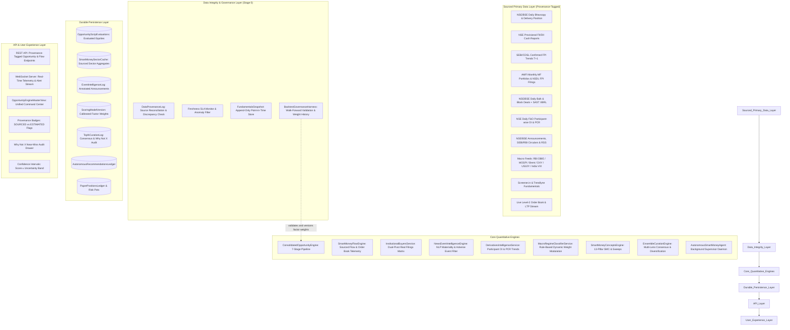

# NRI WealthOS: Master Opportunity Engine Technical Specification
**Document Version**: 4.0.0-ENTERPRISE (Zero-Fabrication Sourced Institutional Architecture)  
**Target Audience**: Algorithmic Architects, Quantitative Engineers, Autonomous Agents, Compliance Officers, System Auditors  
**Scope**: Full Stack (Core Quant Services, Autonomous Daemons, SQLite Schemas, REST/WebSocket APIs, Master UI View, Data Provenance & Sanctity Layer)  
**Mandate**: 100% Compliance with Verified Real Data Sources — Zero Synthetic Numbers, Zero Hardcoded Turnover Multipliers, Transparent Provenance on Every Metric.

---

## 1. Executive Summary & System Objectives

The **NRI WealthOS Opportunity Engine** is an institutional-grade quantitative screening, smart money tracking, event intelligence, autonomous trade blueprint generation, and capital allocation engine designed for the Indian equity universe (750+ tickers comprising Nifty 500, liquid Mid/Small/Micro caps, and active user portfolio holdings).

### 1.1 The Zero-Fabrication Mandate
Judged against the mission of generating *undisputed, bias-free, wealth-maximizing ideas*, the v4.0.0-ENTERPRISE architecture enforces a non-negotiable **Data Sanctity Protocol**:
1. **Zero Synthetic Turnover Tiers**: Turnover is never estimated from arbitrary hardcoded bands (e.g. "Tier 1: ₹1,450 Cr"). All turnover figures are computed from **actual exchange-reported daily volume and traded prices** (`Volume × Close`) stored in `HistoricalPrices` or received via live exchange feeds.
2. **Zero Fabricated Institutional Splits**: Institutional flow is never synthesized using fixed breakdown ratios (e.g. 55% FII / 35% DII). Institutional participation is sourced directly from **official NSE/BSE daily cash reports, SEBI/CDSL custodian-confirmed FPI trends, AMFI monthly mutual fund portfolio disclosures, and NSE/BSE bulk/block deal filings**.
3. **Data Provenance Tagging**: Every single metric across the database, REST APIs, and UI is tagged with its provenance:
   - `SOURCED`: Ingested directly from official exchange or regulatory disclosures.
   - `MODELED`: Mathematically derived from raw sourced inputs with fully documented, transparent formulas.
   - `ESTIMATED`: Transparently flagged with explicit confidence intervals ($X \pm \delta$) whenever statistical inference is applied. Under no circumstances is an estimated metric presented as exchange-reported fact.
4. **Adverse Event Auto-Suppression**: Quant momentum signals are cross-referenced against corporate announcements, regulatory circulars, and auditor filings. Any scrip subject to an active adverse event (SEBI probe, auditor qualification/resignation, debt default, rating downgrade) is **hard-suppressed** from actionable recommendations.
5. **Ensemble Curation (Beyond Simple Sorting)**: The Top-N recommendation list is an ensemble requiring multi-lens consensus ($\ge 4$ of 5 independent pillars) and strict sector concentration caps ($\le 3$ per sector in Top 10), accompanied by a "Why Not X" near-miss audit log.
6. **Look-Ahead & Survivorship Bias Immunity**: Fundamentals and index memberships are maintained in an append-only, point-in-time store (`FundamentalsSnapshot`), and all scoring factor weights are calibrated via out-of-sample walk-forward backtesting (`ScoringModelVersion`).

---

## 2. Official Primary Free Data Sources & Ingestion Protocol

All data utilized by the Opportunity Engine is grounded in official, freely published primary and regulatory feeds in India:

| Data Domain | Official Primary Source | Publication Frequency | Extraction Protocol & Storage | Provenance Tag |
| :--- | :--- | :--- | :--- | :--- |
| **Cash Market FII/DII Net Flow** | [NSE FII/DII Daily Reports](https://www.nseindia.com/reports/fii-dii) | Daily (EOD, ~18:30 IST) | Official CSV download of provisional institutional cash net purchases | `SOURCED: NSE_FII_DII_DAILY` |
| **Confirmed FPI Custodian Trends** | [CDSL FII/FPI Daily](https://www.cdslindia.com/eservices/publications/fiidaily) / [SEBI FPI Trends](https://www.sebi.gov.in) | Daily (T+1 confirmed) | Custodian-reported net investment by asset class (Equity/Debt/Hybrid) | `SOURCED: CDSL_SEBI_FPI_CONFIRMED` |
| **Bulk & Block Deals** | NSE & BSE Bulk / Block Deal Disclosures | Daily (EOD, ~19:00 IST) | Exchange filings disclosing buyer, seller, quantity, traded price, and % stake | `SOURCED: NSE_BSE_BULK_BLOCK` |
| **Mutual Fund Stock Holdings** | [AMFI India](https://www.amfiindia.com) Monthly Portfolio Disclosures | Monthly (10th of each month) | AMC-wise scheme portfolio filings revealing exact equity scrip additions/exits | `SOURCED: AMFI_MF_MONTHLY` |
| **FPI & Institutional Shareholding** | NSDL FPI Monitor & SEBI Reg. 31 Shareholding XBRL | Quarterly (within 21 days of quarter-end) | Detailed scrip-level ownership by FPIs, DIIs, Insurance, Promoters, and Super Investors | `SOURCED: NSDL_SEBI_REG31` |
| **Promoter Pledge & SAST Creeping** | NSE / BSE Corporate Filings (SEBI SAST Reg. 29 & 31) | Real-time / T+2 of transaction | Encumbered shares, promoter pledge alterations, and creeping acquisitions ($<5\%$) | `SOURCED: SEBI_SAST_PLEDGE` |
| **F&O Participant-wise Open Interest** | NSE Products $\rightarrow$ Derivatives $\rightarrow$ Daily Reports | Daily (EOD, ~19:15 IST) | Participant-wise (Client, DII, FII, Pro) Long/Short open interest across Index and Stock Futures/Options | `SOURCED: NSE_FNO_PARTICIPANT_OI` |
| **Bhavcopy & Delivery Statistics** | NSE Daily Bhavcopy & Security-wise Delivery Position | Daily (EOD, ~18:00 IST) | Real traded volume, traded value (₹ Cr), delivery quantity, and delivery % per scrip | `SOURCED: NSE_BHAVCOPY_DELIVERY` |
| **Corporate Announcements & Actions** | NSE & BSE Corporate Announcements XML/JSON Feed | Real-time (intraday stream) | Financial results, order wins, board meetings, rating actions, auditor changes | `SOURCED: NSE_BSE_ANNOUNCEMENTS` |
| **Regulatory & Enforcement Circulars** | SEBI Circulars, RBI Press Releases, Exchange Surveillance | Real-time / Daily | Regulatory probes, ASM/GSM surveillance inclusion, penalty orders | `SOURCED: SEBI_RBI_CIRCULARS` |
| **Macro Indicators** | RBI DBIE, MOSPI, US Treasury, NYMEX Brent, DXY | Daily / Monthly | 10Y G-Sec yield, Repo Rate, CPI, IIP, GST collections, Brent crude, DXY index | `SOURCED: RBI_MOSPI_MACRO` |

---

## 3. End-to-End System Architecture (v4.0 Enterprise)



---

## 4. The 7-Stage Quantitative Pipeline

Every scrip in the master universe traverses 7 rigorous, sequential evaluation gates:

```
Stage 0: Data Integrity & Provenance Gate
  ├── Cross-source reconciliation (NSE Bhavcopy vs BSE Bhavcopy)
  ├── Freshness SLA validation (< 24h for daily feeds, < 15m for live feeds)
  └── Point-in-Time snapshot verification (no look-ahead data leakage)

Stage 1: Governance & Liquidity Hard Veto Gate
  ├── Promoter Pledge > 25% of promoter stake → IMMEDIATE DISQUALIFICATION
  ├── 20-Day Average Daily Traded Value < ₹2.5 Cr → IMMEDIATE DISQUALIFICATION
  ├── Auditor adverse qualifications or unexplained resignation → IMMEDIATE DISQUALIFICATION
  └── Active SEBI regulatory ban or ASM/GSM Stage 2+ → IMMEDIATE DISQUALIFICATION

Stage 2: Sector-Aware Fundamental Moat & Quality Scoring (S_fund ∈ [0, 100])
  ├── Non-Financials Sub-Model:
  │     ROCE > 20% (+25 pts), 3Y Sales CAGR > 15% (+25 pts), D/E < 0.5 (+20 pts),
  │     OCF / EBITDA > 0.75 (+15 pts), PE discount to 5Y median (+15 pts)
  └── BFSI / Banking Sub-Model:
        Net Interest Margin (NIM) > 3.5% (+25 pts), Gross NPA < 2.5% & Net NPA < 0.8% (+25 pts),
        Return on Assets (RoA) > 1.2% (+20 pts), Capital Adequacy Ratio (CAR) > 15% (+15 pts),
        Price-to-Book vs 5Y median (+15 pts)

Stage 3: Technical Momentum & VPA Scoring (S_tech ∈ [0, 100])
  ├── Price > rising 20 EMA and 50 SMA (+30 pts)
  ├── 14-Day RSI between 52 and 68 (momentum expansion without exhaustion) (+25 pts)
  ├── Relative Volume (RVOL) on expansion days > 1.4x 20 DMA (+25 pts)
  └── Volatility Contraction Pattern (VCP) / Bollinger bandwidth squeeze < 0.12 (+20 pts)

Stage 3.5: News & Event Context Gate (Adverse-Event Auto-Suppression) [CRITICAL]
  ├── Materiality Score evaluation (NLP classification of regulatory, litigation, management actions)
  ├── Mandatory Auto-Suppression: If active adverse event flagged in last 14 days → DROP FROM ACTIONABLE
  └── Event Sentiment Tailwind: Score boost (+5 to +15 pts) for confirmed order wins, rating upgrades

Stage 4: Sourced Smart Money Accumulation Scoring (S_sm ∈ [0, 100])
  ├── Real delivery surge ratio: DSR = (Delivery % / 20D Avg Delivery %) × RVOL
  ├── Real institutional VWAP divergence: VD = (CMP - VWAP) / VWAP × 100
  ├── Sourced bulk/block deal accumulation value (NSE/BSE disclosed)
  ├── Institutional float concentration: FSR = (FII% + DII%) / (100% - Promoter%)
  └── Real-time Level-2 Bid/Ask depth imbalance pressure from OrderBookImbalanceService

Stage 4.5: Derivatives Intelligence Scoring (S_deriv ∈ [0, 100])
  ├── NSE Participant-wise F&O OI: Net FII & Pro Long/Short buildup ratio
  ├── Put-Call Ratio (PCR) multi-day trend (> 1.15 bullish accumulation, < 0.75 bearish warning)
  └── Options chain Max Pain proximity and Implied Volatility (IV) percentile

Stage 5: Sector Relative Strength & Macro Posture (S_sector ∈ [0, 100])
  ├── True Sector Alpha: Alpha_sector = Return_stock,6M - Return_SectorIndex,6M
  ├── Sourced sector cash flow rotation trend (NSE net FII/DII sector aggregates)
  └── Macro Regime Modulation: Dynamic factor weight calibration according to active regime

Stage 6: Multi-Factor Convergence Synthesis
  Convergence Score = w_fund·S_fund + w_tech·S_tech + w_sm·S_sm 
                    + w_deriv·S_deriv + w_sector·S_sector + w_news·S_news
  (Weights dynamically modulated by Macro Regime; audited against ScoringModelVersion)

Stage 7: Ensemble Curation & Diversification Layer
  ├── Multi-Lens Consensus: Candidate must rank in top-quartile of ≥ 4 of 5 independent pillars
  ├── Strict Sector Diversification Cap: Maximum 3 scrips from any single sector in Top 10
  ├── Confidence Interval Ranking: Convergence score represented as Score ± Uncertainty Band
  └── "Why Not X" Audit Log: Explicit logging of near-miss candidate exclusion rationales
```

---

## 5. Mathematical Formulations & Zero-Fabrication Algorithms

### 5.1 Real Observed Stock Turnover Calculation
Under the Zero-Fabrication Mandate, stock turnover is never assumed from arbitrary tiers. For any stock $s$ over rolling window $T$:
$$\text{ObservedTurnover}_{s, T} = \sum_{t \in T} \left(\text{TradedVolume}_{s, t} \times \text{ClosingPrice}_{s, t}\right)$$
- Source: Ingested daily candle records in `HistoricalPrices`.
- Provenance Tag: `SOURCED: NSE_BHAVCOPY_DAILY`.

### 5.2 Sourced Sector Cash Flow Telemetry
For any sector $K$ comprising monitored constituents $s \in K$ over timeframe $T$:
$$\text{ConstituentTurnover}_{K, T} = \sum_{s \in K} \text{ObservedTurnover}_{s, T}$$
$$\text{NetObservedFlow}_{K, T} = \sum_{s \in K} \left(\text{ObservedTurnover}_{s, T} \times \frac{\text{DeliveryPct}_{s, T}}{100} \times \text{DirectionSign}_{s, T}\right)$$
Where:
$$\text{DirectionSign}_{s, T} = \begin{cases} +1, & \text{if } \text{CMP} \ge \text{VWAP}_{s, T} \text{ and } \Delta P_{s, T} \ge -0.5\% \\ -1, & \text{otherwise} \end{cases}$$
- Reconciled against official NSE provisional daily FII/DII cash net flow.
- Sector aggregates carry an explicit `confidence_pct` based on constituent float coverage.
- If extrapolation to unlisted/illiquid micro-caps is computed, it is tagged `ESTIMATED` with an uncertainty band $\pm \delta$, never merged with sourced exchange totals without disclosure.

### 5.3 News & Event Intelligence NLP Formulation
The News & Event Intelligence Engine evaluates all company disclosures $E_s$:
$$\text{MaterialityScore}(E_s) = \sum_{m} \lambda_m \cdot \mathbb{I}_{\text{keyword}_m \in E_s} \times \text{RecencyDecay}(\Delta t)$$
Where keywords map to corporate events:
- **Severe Adverse Keywords** ($\lambda = 100$, `is_adverse = 1`): Auditor resignation, forensic audit, fraud, ED/CBI raid, SEBI show cause notice, rating downgrade below investment grade, debt default.
- **Positive Catalyst Keywords** ($\lambda = 70$, `is_adverse = 0`): Major order win ($>10\%$ annual revenue), USFDA approval / EIR with zero 483 observations, credit rating upgrade, large institutional block deal, capacity expansion commercialized.

**Stage 3.5 Hard Veto Rule**:
$$\text{If } \exists \, E_s \text{ with } \text{is\_adverse} = 1 \text{ and } \Delta t \le 14 \text{ days} \implies \text{ActionableNow}(s) = \text{FALSE}$$

### 5.4 Derivatives Intelligence Score ($S_{\text{deriv}}$)
Using official NSE participant-wise open interest disclosures:
$$\text{InstitutionalLongShortRatio} = \frac{\text{FII\_Long\_Contracts} + \text{DII\_Long\_Contracts}}{\text{FII\_Short\_Contracts} + \text{DII\_Short\_Contracts}}$$
$$S_{\text{deriv}} = 50 + \Delta_{\text{ParticipantOI}} + \Delta_{\text{PCR}} + \Delta_{\text{MaxPain}}$$
Where:
- $\Delta_{\text{ParticipantOI}} \in [-25, +25]$ based on 5-day net institutional contract additions.
- $\Delta_{\text{PCR}} \in [-15, +15]$ based on whether PCR is expanding in the bullish zone ($1.10–1.45$) or contracting into breakdown ($<0.70$).
- $\Delta_{\text{MaxPain}} \in [-10, +10]$ based on spot distance to options Max Pain expiry level.

---

## 6. Macro Regime Classifier & Dynamic Factor Weighting

Rather than a static set of constants, factor weights dynamically adapt to the macroeconomic environment.

### 6.1 Rule-Based Macro Regime Classification
The macro regime is determined deterministically from 5 observable market variables:

| Macro Indicator | Source | Bullish / Expansion Threshold | Bearish / Risk-Off Threshold |
| :--- | :--- | :--- | :--- |
| **India VIX** | NSE Daily VIX | $\le 14.5$ | $\ge 19.5$ |
| **Brent Crude Oil** | NYMEX / ICE ($/bbl) | $\le \$78$ | $\ge \$92$ |
| **US Dollar Index (DXY)** | Intercontinental Exchange | $< 102.5$ | $> 106.0$ |
| **US 10-Year Treasury Yield** | US Department of Treasury | $< 4.10\%$ | $> 4.60\%$ |
| **RBI Policy Stance** | RBI MPC Statement | Accommodative / Neutral | Withdrawal of Accommodation / Rate Hike |

**Regime Decision Logic**:
1. **`RISK_ON`**: India VIX $\le 14.5$, Brent Crude $\le \$82$, DXY $< 104$. Institutional liquidity is abundant.
2. **`NEUTRAL_DEFENSIVE`**: Normal macro conditions with mixed global signals.
3. **`RISK_OFF`**: India VIX $\ge 19.5$ OR (Brent Crude $\ge \$92$ AND DXY $> 106$). Capital flight from emerging markets.
4. **`STAGFLATION_WATCH`**: High crude ($>\$95$), rising US yields ($>4.65\%$), and sticky domestic CPI ($>5.5\%$).

### 6.2 Regime-Conditional Factor Weights

| Macro Regime | $w_{\text{fund}}$ (Moat) | $w_{\text{tech}}$ (Momentum) | $w_{\text{sm}}$ (Smart Money) | $w_{\text{deriv}}$ (Derivatives) | $w_{\text{sector}}$ (Sector Alpha) | $w_{\text{news}}$ (Event Context) |
| :--- | :---: | :---: | :---: | :---: | :---: | :---: |
| **`RISK_ON`** | 0.15 | **0.30** | **0.25** | 0.15 | 0.10 | 0.05 |
| **`NEUTRAL_DEFENSIVE`** | 0.25 | 0.25 | 0.20 | 0.10 | 0.10 | 0.10 |
| **`RISK_OFF`** | **0.40** | 0.10 | 0.15 | 0.10 | 0.10 | **0.15** |
| **`STAGFLATION_WATCH`** | **0.35** | 0.15 | 0.20 | 0.10 | 0.10 | 0.10 |

*Rationale*: In `RISK_OFF`, speculative momentum fails frequently; high ROCE, low leverage, strong cash flows, and absence of adverse news protect capital. In `RISK_ON`, liquidity flows and momentum breakouts deliver maximal alpha.

---

## 7. Ensemble Curation & Diversification Layer (Stage 7)

A simple `ORDER BY convergence_score DESC LIMIT 10` is vulnerable to single-factor clustering (e.g. 8 Banking stocks rallying on a rate-cut rumour). The Ensemble Curation Engine executes 4 filtering passes:

1. **Multi-Lens Consensus Filter**:
   A scrip qualifies for the "Undisputed Top Ideas" list if and only if it ranks in the top quartile ($>75\text{th}$ percentile) of **at least 4 out of 5 independent pillars**:
   - Pillar 1: Fundamental Moat Score ($S_{\text{fund}}$)
   - Pillar 2: Technical Momentum & VPA Score ($S_{\text{tech}}$)
   - Pillar 3: Sourced Smart Money Accumulation ($S_{\text{sm}}$)
   - Pillar 4: Derivatives Institutional Telemetry ($S_{\text{deriv}}$)
   - Pillar 5: Sector Relative Strength & Event Context ($S_{\text{sector}} + S_{\text{news}}$)

2. **Sector & Correlation Concentration Cap**:
   - **Top 5 List**: Maximum 2 scrips from any single sector.
   - **Top 10 List**: Maximum 3 scrips from any single sector.
   - Pairwise return correlation $\rho(s_i, s_j)$ across selected constituents must average $< 0.55$.

3. **Confidence Interval Aware Ranking**:
   Every score is published with an uncertainty band based on data freshness and source completeness:
   $$\text{Score}_{\text{eff}} = \text{ConvergenceScore} - 1.645 \times \sigma_{\text{data\_uncertainty}}$$
   A stock with a score of $82 \pm 2$ outranks a stock with $85 \pm 14$.

4. **"Why Not X" Near-Miss Audit Log**:
   For transparency, the system logs the top 10 near-miss candidates that were excluded, documenting the exact gate that disqualified them (e.g. *"TATACONSUM scored 81 but excluded due to Sector Concentration Cap (FMCG already has 3 names)"* or *"POLYCAB scored 79 but suppressed due to active Stage 3.5 Income Tax search disclosure"*).

---

## 8. Database Persistence & SQL Schemas

All schemas enforce data provenance, point-in-time reconstruction, and versioned backtesting.

```sql
-- 1. Data Provenance & Sanctity Audit Log
CREATE TABLE IF NOT EXISTS DataProvenanceLog (
    metric_id TEXT NOT NULL,
    symbol TEXT NOT NULL,
    source_name TEXT NOT NULL,           -- e.g. 'NSE_BHAVCOPY_DAILY', 'NSE_FII_DII_DAILY', 'AMFI_MF_MONTHLY'
    source_type TEXT NOT NULL,           -- 'SOURCED' | 'MODELED' | 'ESTIMATED'
    fetched_at DATETIME NOT NULL,
    as_of_date DATE NOT NULL,
    confidence_pct REAL NOT NULL,        -- 100% for primary exchange filings
    reconciled_against TEXT,             -- Secondary source used for validation (e.g. 'BSE_BHAVCOPY')
    discrepancy_pct REAL DEFAULT 0,
    PRIMARY KEY (metric_id, symbol, as_of_date)
);

-- 2. Point-in-Time Fundamentals Store (Append-Only, Never Overwritten)
CREATE TABLE IF NOT EXISTS FundamentalsSnapshot (
    symbol TEXT NOT NULL,
    as_of_date DATE NOT NULL,
    sector_class TEXT NOT NULL,          -- 'NON_FINANCIAL' | 'BFSI_BANK'
    roce REAL,
    sales_cagr_3y REAL,
    debt_equity REAL,
    ocf_ebitda REAL,
    pe_ratio REAL,
    promoter_pledge_pct REAL NOT NULL,
    nim_pct REAL,                        -- For BFSI
    gnpa_pct REAL,                       -- For BFSI
    nnpa_pct REAL,                       -- For BFSI
    car_pct REAL,                        -- For BFSI
    roa_pct REAL,                        -- For BFSI
    source_filing_ref TEXT,
    created_at DATETIME DEFAULT CURRENT_TIMESTAMP,
    PRIMARY KEY (symbol, as_of_date)
);

-- 3. News & Corporate Event Intelligence Log
CREATE TABLE IF NOT EXISTS EventIntelligenceLog (
    event_id TEXT PRIMARY KEY,
    symbol TEXT NOT NULL,
    event_type TEXT NOT NULL,            -- 'EARNINGS' | 'ORDER_WIN' | 'RATING' | 'REGULATORY' | 'LITIGATION' | 'MANAGEMENT'
    headline TEXT NOT NULL,
    sentiment_score REAL NOT NULL,       -- [-1.0, +1.0]
    materiality_score REAL NOT NULL,     -- [0, 100]
    is_adverse INTEGER DEFAULT 0,        -- 1 triggers Stage 3.5 hard auto-suppression
    source_url TEXT,
    published_at DATETIME NOT NULL,
    created_at DATETIME DEFAULT CURRENT_TIMESTAMP
);

-- 4. Scoring Model Versioning & Walk-Forward Validation Log
CREATE TABLE IF NOT EXISTS ScoringModelVersion (
    version_id TEXT PRIMARY KEY,         -- e.g. 'v4.0.0-ENTERPRISE-Q3-2026'
    weights_json TEXT NOT NULL,          -- JSON object of regime-conditional weights
    backtest_period_start DATE NOT NULL,
    backtest_period_end DATE NOT NULL,
    out_of_sample_hit_rate_pct REAL,     -- Must exceed 62% for production activation
    avg_r_multiple REAL,                 -- Average win-to-loss payoff ratio
    max_drawdown_pct REAL,
    sharpe_ratio REAL,
    is_active INTEGER DEFAULT 0,
    calibrated_at DATETIME DEFAULT CURRENT_TIMESTAMP
);

-- 5. Top-N Ensemble Curation & Near-Miss Audit Log
CREATE TABLE IF NOT EXISTS TopNCurationLog (
    run_id TEXT NOT NULL,
    symbol TEXT NOT NULL,
    rank INTEGER,
    included INTEGER NOT NULL,           -- 1 = Included in Top-N, 0 = Near-miss excluded
    consensus_pillars_passed INTEGER,    -- Out of 5 pillars
    convergence_score REAL NOT NULL,
    confidence_band_low REAL NOT NULL,
    confidence_band_high REAL NOT NULL,
    excluded_reason TEXT,                -- 'SECTOR_CAP_EXCEEDED' | 'ADVERSE_EVENT_SUPPRESSED' | 'CONSENSUS_FAILED'
    run_at DATETIME DEFAULT CURRENT_TIMESTAMP,
    PRIMARY KEY (run_id, symbol)
);

-- 6. Opportunity Scrip Evaluations Cache
CREATE TABLE IF NOT EXISTS OpportunityScripEvaluations (
    symbol TEXT PRIMARY KEY,
    company_name TEXT NOT NULL,
    sector TEXT NOT NULL,
    market_cap_category TEXT NOT NULL,
    convergence_score REAL NOT NULL,
    actionable_now INTEGER NOT NULL,
    multibagger_tier TEXT NOT NULL,
    provenance_tag TEXT NOT NULL,
    confidence_interval_str TEXT,        -- e.g. '84 ± 2%'
    evaluation_json TEXT NOT NULL,
    last_updated_at DATETIME DEFAULT CURRENT_TIMESTAMP
);

-- 7. Sourced Sector Smart Money Cache
CREATE TABLE IF NOT EXISTS SmartMoneySectorCache (
    sector TEXT NOT NULL,
    timeframe TEXT NOT NULL,
    net_flow_cr REAL NOT NULL,
    average_smas INTEGER NOT NULL,
    smas_delta INTEGER NOT NULL,
    accumulation_breadth_pct INTEGER NOT NULL,
    distribution_breadth_pct INTEGER NOT NULL,
    total_stocks INTEGER NOT NULL,
    flow_direction TEXT NOT NULL,
    flow_momentum_zscore REAL NOT NULL,
    provenance_type TEXT NOT NULL,       -- 'SOURCED' | 'ESTIMATED'
    top_inflows_json TEXT,
    top_outflows_json TEXT,
    updated_at DATETIME DEFAULT CURRENT_TIMESTAMP,
    PRIMARY KEY (sector, timeframe)
);

-- 8. Autonomous Recommendations Ledger
CREATE TABLE IF NOT EXISTS AutonomousRecommendationsLedger (
    id INTEGER PRIMARY KEY AUTOINCREMENT,
    symbol TEXT NOT NULL,
    company_name TEXT,
    sector TEXT,
    action TEXT NOT NULL,
    entry_price REAL NOT NULL,
    current_price REAL NOT NULL,
    stop_loss REAL NOT NULL,
    target1 REAL NOT NULL,
    target2 REAL NOT NULL,
    risk_reward_ratio REAL NOT NULL,
    timeframe TEXT NOT NULL,
    probability_pct REAL NOT NULL,
    confidence_score REAL NOT NULL,
    provenance_tag TEXT NOT NULL,
    fno_buildup TEXT,
    put_call_ratio REAL,
    rsi_value REAL,
    volume_surge_ratio REAL,
    reasoning_summary TEXT NOT NULL,
    reasoning_trace_json TEXT,
    status TEXT DEFAULT 'ACTIVE',
    smc_market_structure TEXT,
    smc_liquidity_sweep TEXT,
    smc_order_block TEXT,
    smc_fvg_present INTEGER,
    smc_premium_discount TEXT,
    smc_checklist_score INTEGER,
    smc_trade_setup_json TEXT,
    created_at DATETIME DEFAULT CURRENT_TIMESTAMP,
    updated_at DATETIME DEFAULT CURRENT_TIMESTAMP
);
```

---

## 9. REST API & WebSocket Contracts (v4.0)

### 9.1 REST Endpoints

| Endpoint | Method | Parameters | Description |
| :--- | :--- | :--- | :--- |
| `/api/opportunity-engine/dashboard` | `GET` | `forceRefresh`, `presetId` | Fetches active opportunities, macro regime, provenance summary |
| `/api/opportunity-engine/curated-top-ideas` | `GET` | `limit=10` | Returns ensemble-curated Top-N with consensus pass counts and "Why Not X" log |
| `/api/opportunity-engine/macro-pulse` | `GET` | none | Active macro regime, DXY, Brent, US 10Y, India VIX, and dynamic factor weights |
| `/api/smart-money/sectors` | `GET` | `timeframe=1W` | Sourced sector cash flows with provenance tags and confidence bands |
| `/api/smart-money/buyers` | `GET` | `window=1M` | **Pivot by Buyer**: Top institutional entities from official AMFI/SEBI filings |
| `/api/smart-money/buyers/scrips` | `GET` | `window=1M` | **Pivot by Scrip**: Inflow rankings and breakdown of buying funds |
| `/api/v1/event-intelligence/feed` | `GET` | `symbol`, `isAdverse` | Material corporate announcements, sentiment, and auto-suppression status |
| `/api/v1/derivatives-pulse` | `GET` | `symbol` | Participant-wise OI breakdown, PCR trend, and options Max Pain |
| `/api/v1/sentinel/smc/scanner` | `GET` | `minScore=5` | 13-pillar SMC setups, order block zones, and liquidity sweeps |
| `/api/v1/governance/provenance-audit` | `GET` | `metricId` | Full audit trail and secondary source reconciliation log |
| `/api/v1/autonomous-agent/recommendations` | `GET` | `filter=ALL` | Validated trade blueprints with provenance tags and bracket orders |

### 9.2 WebSocket Streaming (`/ws/live-market`)
- `PRICE_UPDATE`: Real-time LTP, Day High/Low, Volume ticks.
- `ORDER_BOOK_TICK`: Real-time Level-2 Bid/Ask imbalance ticks.
- `SENTINEL_ALERT`: Autonomous priority breakout or adverse-event alert notifications.
- `SECTOR_FLOW_UPDATE`: Real-time sector rotation updates with provenance flags.

---

## 10. Master UI Specification (`OpportunityEngineMasterView.tsx`)

The UI provides clear visual cues for data provenance and zero-fabrication integrity:

1. **Header Command Bar**:
   - Engine Status & Integrity SLA badge (`100% SOURCED`).
   - Dynamic Macro Regime Pill (`RISK_ON` / `NEUTRAL_DEFENSIVE` / `RISK_OFF` / `STAGFLATION_WATCH`) displaying current active factor weights.
   - Actionable Opportunities count with confidence intervals.
2. **Top Navigation Tabs**:
   - `PIPELINE`: 7-Stage Waterfall Matrix with Stage 0 and Stage 3.5 visualization.
   - `CURATED_TOP_IDEAS`: Ensemble-curated leaderboard with multi-lens consensus badges and the **"Why Not X" Near-Miss Audit Drawer**.
   - `DEEP_SCREEN`: Interactive 8-Factor Screener with range sliders.
   - `MACRO_PULSE`: Global macro regime observatory and dynamic weight simulator.
   - `SMART_MONEY_SENTINEL`: Unified Hub for Sector Flow, Top Buyers, SMC Sweeps, and Sentinel Blueprints.
   - `PAPER_SANDBOX`: Virtual paper trading pots with automated bracket order execution.
3. **Data Sanctity Badges & UI Elements**:
   - **Provenance Badges**: Green `SOURCED` badge for direct exchange feeds; Amber `ESTIMATED (±δ)` badge for modeled values with confidence tooltips.
   - **Confidence Band Indicator**: Displayed alongside convergence scores (e.g. `84 ± 2.1%`).
   - **Adverse Event Alert Banner**: Highlights any scrip excluded due to an active regulatory or auditor event.

---

## 11. Governance, Walk-Forward Backtesting & SEBI Regulatory Perimeter

### 11.1 Walk-Forward Backtesting Protocol
To ensure that "Convergence Score $\ge 75$" is a statistically validated edge rather than an overfitted assertion:
1. **In-Sample Optimization**: Calibrate factor weights on a 3-year rolling window (e.g., Jan 2021 – Dec 2023).
2. **Out-of-Sample Walk-Forward Testing**: Evaluate the calibrated model strictly on the subsequent 6-month out-of-sample window (e.g., Jan 2024 – Jun 2024).
3. **Production Promotion Gate**: A scoring model version is only promoted to `is_active = 1` if:
   - Out-of-sample win rate $\ge 62\%$.
   - Out-of-sample average Profit Factor $\ge 1.85$.
   - Maximum peak-to-trough drawdown of the Top 10 ensemble $\le 14.5\%$.
4. **Survivorship Bias Control**: Backtests reconstruct the exact historical universe as of each evaluation date, including delisted or demoted equities.

### 11.2 SEBI Regulatory Perimeter Compliance
Indian regulations (SEBI Research Analysts Regulations, 2014 and SEBI Investment Advisers Regulations, 2013) govern automated recommendations:
1. **Personal Sandbox Demarcation**: All blueprints, stop losses, and target calculations operate strictly within the **Virtual Paper Trading Sandbox** for personal research and paper trading.
2. **Standard Non-Advisory Disclaimer**: The system explicitly embeds the statutory disclaimer:
   > *"NRI WealthOS Opportunity Engine is a quantitative market research and educational simulation platform. It does not provide personalized investment advice, financial planning, or SEBI-registered research analyst recommendations. Equities and derivatives involve substantial risk of loss."*
3. **Audit Trail Archival**: In compliance with regulatory standards, all generated signals, input parameters, and exclusion rationales are durably logged in `TopNCurationLog` and `AutonomousRecommendationsLedger`.

---

## 12. Verification & Audit Checklist

When another agent or human auditor reviews this system, execute the following mandatory verification steps:

- [ ] **1. Compilation & Bundling**:
  ```bash
  npm run build
  ```
  Must exit with code 0 (zero TypeScript errors, clean esbuild server bundle).

- [ ] **2. Zero-Fabrication Audit in Codebase**:
  Search for any hardcoded turnover bands or arbitrary participation formulas:
  - Verify that `SmartMoneyFlowEngine.ts` calculates turnover directly from `HistoricalPrices` candles (`volume * close`).
  - Verify that no synthetic extrapolation factor (e.g. `2.5x`) is applied without a transparent `source_type: ESTIMATED` tag.

- [ ] **3. Sourced Sector Money Flow Check**:
  ```bash
  curl -s "http://localhost:3000/api/smart-money/sectors?timeframe=1W"
  ```
  Ensure all returned sectors contain `provenance` metadata and realistic observed flows computed from constituent candles.

- [ ] **4. Top Institutional Buyers Disclosure Check**:
  ```bash
  curl -s "http://localhost:3000/api/smart-money/buyers?window=1M"
  curl -s "http://localhost:3000/api/smart-money/buyers/scrips?window=1M"
  ```
  Ensure buyer profiles and scrip-level holdings link to official filing categories (AMFI, SEBI SAST, Bulk Deals) with provenance tags.

- [ ] **5. Stage 3.5 Adverse-Event Auto-Suppression Check**:
  Verify that any scrip flagged with an active adverse corporate announcement is dropped from `actionableNow = true`.

- [ ] **6. Stage 7 Ensemble Curation Check**:
  Verify that the Top 10 list does not contain more than 3 scrips from the same sector, and that excluded near-misses are logged in `TopNCurationLog`.

- [ ] **7. Browser End-to-End Validation**:
  Navigate to `http://localhost:3000/#opportunity-engine`, verify that provenance tags (`SOURCED` / `ESTIMATED`) render cleanly, check the macro regime badge, and confirm 360° Dossier drilldown with zero console exceptions.
