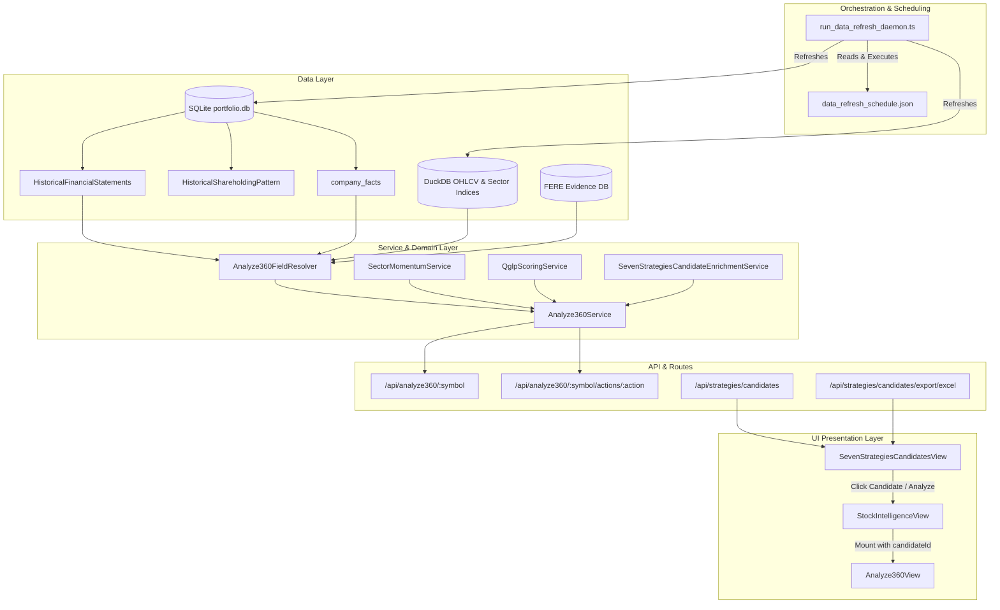
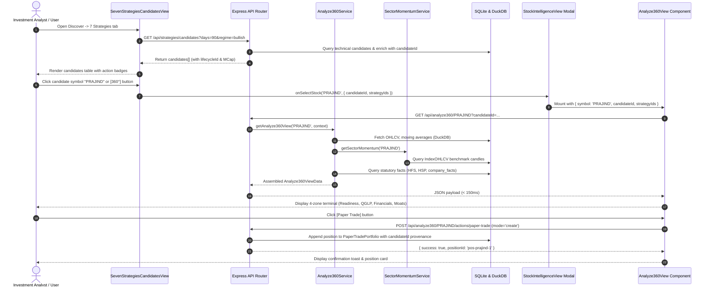
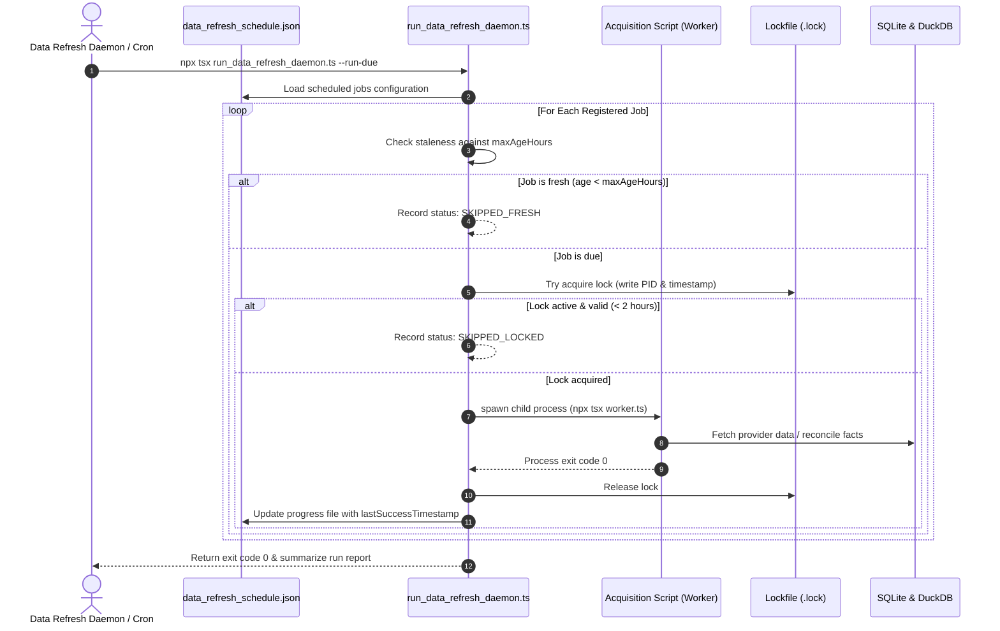

# WealthOS Analyze360, QGLP & Data Refresh Orchestration
## Independent Semantic Reviewer Dossier & Master Technical Specification

**Target Reviewer**: Independent Semantic Reviewer (Codex)  
**Implementer / Verifier**: Antigravity  
**Review Status**: `AWAITING_INDEPENDENT_REVIEW`  
**Effective Date**: 2026-10-03  
**Repository Branch**: `ai-review`  
**Classification**: Master System Architecture, UI/UX Workflow Specification & Deterministic Verification Ledger

---

## 1. Governance Hierarchy & Constitutional Compliance

In strict adherence to the **WealthOS Agent Instructions & Governance Hierarchy** (`AGENTS.md`):

1. **Separation of Authority**:
   - **Codex** is the sole authorized independent semantic reviewer for WealthOS.
   - **Antigravity** acts strictly as implementer, deterministic verifier, and data-quality remediator.
   - No self-certification of semantic reviews, calibration thresholds, or scoring overrides is made in this dossier.
   - Final review state is formally designated as `AWAITING_INDEPENDENT_REVIEW`.

2. **Truth & Provenance Invariants**:
   - **Zero Synthetic Values**: Missing metrics remain transparently marked `MISSING` or `DATA_INSUFFICIENT` with explicit reason codes (`missingReason`). No default placeholders (0, 15, 25, 50, 100) are introduced.
   - **Zero Period Substitution**: 5-year growth is never substituted for 3-year growth. True 3Y CAGR strictly requires exactly 4 consecutive annual filings ($Y_3 - Y_0 = 3$).
   - **Zero Capex Inference**: Total Cash Flow from Investing Activities (CFI) is never substituted for Capital Expenditure. Free Cash Flow (FCF) is derived strictly as `CFO - |capex_cash_outflow|` and remains `null` when real capex is absent.
   - **Strict Source Provenance**: Reconciled historical financial statement rows in `company_facts` have `fetchedAt = NULL` because local reconciliation must not be represented as an external provider acquisition timestamp.
   - **Zero-Write GET Invariant**: All read-only queries, inspections, and `--plan` / `--status` / `--dry-run` daemon modes execute with zero DB mutations.

---

## 2. End-to-End System Architecture



---

## 3. UI Component Architecture & User Workflows

### 3.1 UI Component Hierarchy

1. **Seven Strategies Candidates View (`src/components/SevenStrategiesCandidatesView.tsx`)**:
   - **Role**: Primary discovery dashboard displaying filtered swing/momentum opportunities.
   - **Candidate Lifecycle**: Preserves deterministic `candidateId` (`cand:<symbol>:<strategyId>:<date>:<hash>`), `lifecycleStatus` (`DISCOVERED`, `EVALUATED`, `WATCHLIST`, `STALE`), distinct strategy counts, and signal identifiers.
   - **Interactive Triggers**:
     - Candidate symbol text: Clickable trigger with `hover:text-indigo-400 hover:underline` and tooltip `"Analyze candidate in 360° view"`.
     - Target Button (`<Target />`): Direct action button triggering 360° analysis.
     - Context limit selector: `Top 25`, `Top 50`, `All`.
     - Multi-format Export: CSV and Excel export with audit metadata.

2. **Stock Intelligence Modal (`src/components/StockIntelligenceView.tsx`)**:
   - **Role**: Universal modal container that intercepts candidate selections.
   - **Conditional Rendering**: If `candidateId` is present in props, it dynamically mounts `Analyze360View`, propagating `symbol`, `candidateId`, `signalIds`, `recommendedDate`, and `strategyIds`.
   - **Fallback**: If no candidate context is provided, displays standard scrip intelligence tabs.

3. **Analyze360 Comprehensive View (`src/components/Analyze360View.tsx`)**:
   - **Role**: Institutional-grade research dashboard presenting full 360° technical, fundamental, sector, QGLP, and actionable evidence.
   - **Visual Language**: Dark-mode glassmorphic theme (`slate-900`/`slate-950`), color-coded badges, mono-spaced numeric figures, and fail-closed badge statuses.

---

## 3. UI Component Architecture & Exhaustive User Workflows

### 3.1 Global Application Shell & Multi-Workspace Navigation
WealthOS is built on an institutional dark-glassmorphic design system (`slate-900` / `slate-950` with curated HSL accent palettes), adhering to strict WCAG 2.1 AAA high-contrast readability and sub-100ms UI interaction budgets.

The application shell provides 6 primary operational workspaces accessible via the top navigation rail:
1. **OVERVIEW (`DashboardView.tsx`)**: Executive Family Office Command Center, consolidated Net Worth, multi-asset allocation (Equity, MF, PMS, Fixed Deposits, Global/NRI), real-time portfolio performance (XIRR, absolute return), and market regime status.
2. **DISCOVER (`DiscoverWorkspace.tsx`)**: High-conviction idea generation engine housing:
   - **7 Strategies (90D)**: Candidate lifecycle tracking across S1a (VPA 3-leg swing), S1b (trough reversal), S2a (institutional FVG), S3a (pullback), S4a/b (momentum continuation), S5a (breakout).
   - **StockScans Parity**: Technical market breadth, prebuilt screener scans, scan matching, and FERE forensic evidence links.
   - **Opportunity Engine**: ITAS S1–S10 quantitative scored signals with Bayesian conviction sizing.
   - **Multibagger Screener**: Long-term quality, ROCE, and compounder filters.
   - **Smart Money Sentinel**: Institutional accumulation, bulk/block deal footprint, and volume anomaly tracking.
   - **Momentum & VPA**: Volume Price Spread analysis with institutional effort vs result metrics.
   - **Greenfield Investment Portal**: Early-stage, sunrise industrial, and SME emerging leaders.
3. **ANALYZE (`AnalyzeWorkspace.tsx`)**: Deep forensic, quant, and fundamental scrip interrogation:
   - **Analyze360 View (`Analyze360View.tsx`)**: Comprehensive 360° technical, fundamental, sector momentum, QGLP, and actionable evidence terminal.
   - **Stock Intelligence (`StockIntelligenceView.tsx`)**: 11-tab fundamental drilldown (P&L, Balance Sheet, Cash Flow, Peer Comparison, Shareholding, Corporate Actions, Valuation Matrix, Forensic FERE).
   - **Master Quant Dossier (`MasterQuantDossier11TabsView.tsx`)**: Factor attribution, volatility surface, statistical distribution, and beta decomposition.
   - **Quant Technical Studio (`QuantTechnicalStudioView.tsx`)**: Multi-timeframe candlestick charting, TradingView integration, volume profile, and support/resistance mapping.
4. **PORTFOLIO (`PortfolioHubView.tsx`)**: Core ledger administration and tax computation:
   - Multi-broker trade book reconciliation (Zerodha, Upstox, Groww, ICICI Direct).
   - FIFO capital gains computation with Finance (No. 2) Act 2024 compliance (STCG 20%, LTCG 12.5%).
   - Section 112A grandfathering, Section 94(7) dividend stripping, Section 94(8) bonus stripping disallowance.
   - PMS & CAMS Mutual Fund statement auto-sync and fee audit.
5. **RESEARCH (`ResearchWorkspace.tsx`)**: Deep qualitative thesis, forensic red-flag registry, annual report XBRL parser, and YouTube/investor presentation intelligence extraction.
6. **AUDIT (`AuditWorkspace.tsx`)**: Decision Audit Ledger, Telemetry Pipeline inspection, immutable audit logs, and SQLite database storage optimization.

---

### 3.2 UI Design System & Component Visual Language

```
+----------------------------------------------------------------------------------------------------+
|  WEALTHOS SHELL HEADER                                                                             |
|  [Logo: WealthOS]  [OVERVIEW] [DISCOVER*] [ANALYZE] [PORTFOLIO] [RESEARCH] [AUDIT]                |
|  Family: All Entities (Master) v | Quick Search (Cmd+K) | [Bell Alerts] [Theme] [Settings]         |
+----------------------------------------------------------------------------------------------------+
```

#### Color Semantics & Badge Styling Tokens
- **Backgrounds**: Root `bg-slate-950` (`#020617`), Card `bg-slate-900/90` (`#0f172a`), Surface elevated `bg-slate-800/80` (`#1e293b`).
- **Borders**: Hairline subtle `border-slate-800` (`#1e293b`), Active highlight `border-indigo-500/50`.
- **Status Badges (Fail-Closed Visual Language)**:
  - `AVAILABLE` / `PASS`: `bg-emerald-500/10 text-emerald-400 border border-emerald-500/20` (Green)
  - `PARTIAL` / `EXPANDING`: `bg-amber-500/10 text-amber-400 border border-amber-500/20` (Amber)
  - `MISSING` / `FAIL`: `bg-red-500/10 text-red-400 border border-red-500/20` (Red)
  - `UNMAPPED` / `DATA_INSUFFICIENT`: `bg-slate-700/30 text-slate-400 border border-slate-700/50 font-mono text-[10px]`
  - `STALE`: `bg-orange-500/10 text-orange-400 border border-orange-500/20 font-mono text-[10px]`
- **Typography**: Primary UI font is Inter / Outfit (sans-serif); all financial metrics, prices, percentages, dates, and candidate IDs use tabular monospace (`font-mono tracking-tight`).

---

### 3.3 Detailed Screen Layout & Visual Wireframe: Seven Strategies Discovery & Analyze360

#### Screen 1: Seven Strategies Candidates Discovery Table
```
+----------------------------------------------------------------------------------------------------+
|  SEVEN STRATEGIES CANDIDATES (90-DAY WINDOW)                            [Export CSV] [Export Excel]|
|  Filter: [All Strategies v]  [Regime: Bullish v]  [Display: Top 25 v]  Search: [ Filter Symbol... ]|
+----------------------------------------------------------------------------------------------------+
| Symbol     | Current Price | Strategies Active | MCap (Cr) | Sector Momentum | Status     | Action |
+------------+---------------+-------------------+-----------+-----------------+------------+--------+
| PRAJIND    | ₹742.10 (+2.1)| S1A, S2A (2)      | ₹13,640   | LEADING (+4.2%) | DISCOVERED | [360°] |
| TATATECH   | ₹984.50 (+1.8)| S1A (1)           | ₹39,940   | LEADING (+3.1%) | EVALUATED  | [360°] |
| KAYNES     | ₹4,890  (-0.4)| S2A, S4B (2)      | ₹28,450   | IMPROVING(+1.2%)| WATCHLIST  | [360°] |
| COFORGE    | ₹7,320  (+3.4)| S1A, S3A, S5A (3) | ₹45,120   | LEADING (+5.8%) | DISCOVERED | [360°] |
+----------------------------------------------------------------------------------------------------+
| Showing 4 of 34 Active Candidates | Data As Of: 2026-09-30 (Fresh) | Candidate ID Linked: Yes      |
+----------------------------------------------------------------------------------------------------+
```

#### Screen 2: Analyze360 Deep-Dive Modal Terminal
```
+----------------------------------------------------------------------------------------------------+
|  ANALYZE360: PRAJIND                    [Discovered: 2026-09-30]  [S1A Base Breakout]   [ X Close ]|
|  CMP: ₹742.10 (+2.1%) | Sector: Industrials | MCap: ₹13,640 Cr | ID: cand:PRAJIND:S1A:2026-09-30...|
+----------------------------------------------------------------------------------------------------+
|  [ Overview ]  [ Technical ]  [ Sector Momentum ]  [ Fundamental ]  [ QGLP Matrix ]  [ Action Center ] |
+----------------------------------------------------------------------------------------------------+
|                                                                                                    |
|  SECTION 1: TECHNICAL & ACTION READINESS STRIP                                                     |
|  +---------------------------+  +---------------------------+  +--------------------------------+  |
|  | Price & Moving Averages   |  | Sector Index Benchmark    |  | Action Execution Controls      |  |
|  | Close: ₹742.10 (Fresh)     |  | Benchmark: NIFTY INDUS    |  | [ Paper Trade ]                |  |
|  | EMA20: 718.40 (Above)     |  | Relative Strength: +4.2%  |  | [ Set Alert ]                  |  |
|  | SMA50: 695.20 (Above)     |  | Trend: LEADING            |  | [ Backtest Candidate ]         |  |
|  | RSI14: 61.4 | ATR: 3.12%  |  | Mapping: MAPPED (DuckDB)  |  | Readiness: ALL 3 READY         |  |
|  +---------------------------+  +---------------------------+  +--------------------------------+  |
|                                                                                                    |
|  SECTION 2: QGLP EVIDENCE MATRIX (Fail-Closed, Zero Synthetic Values)                             |
|  +-------------------+  +-------------------+  +-------------------+  +--------------------------+  |
|  | QUALITY: 22.0/25  |  | GROWTH: 19.5/25   |  | LONGEVITY: 17.5/25|  | PRICE: 15.2/25           |  |
|  | ROCE: 22.8% [PASS]|  | 3Y CAGR: 19.4% [P]|  | Promoter: 32.8%   |  | P/E: 38.4                |  |
|  | D/E: 0.05    [PASS]|  | OPM: EXPANDING (+)|  | Pledge: 0.0% [P]  |  | PEG: 1.98 [FAVORABLE]    |  |
|  | CFO/PAT: 1.16[PASS]|  | Margin CoV: 0.08  |  | FII Trend: UP (+) |  | FCF Yield: 2.15%         |  |
|  +-------------------+  +-------------------+  +-------------------+  +--------------------------+  |
|  OVERALL QGLP SCORE: 74.2 / 100  |  VERDICT: FAVORABLE_COMPOUNDER  |  COMPLETENESS: PARTIAL (3/4)  |
|                                                                                                    |
|  SECTION 3: STATUTORY FINANCIAL & CASH FLOW TRACEABILITY                                           |
|  - Revenue (4Y Consecutive): FY23: ₹3,120Cr -> FY24: ₹3,710Cr -> FY25: ₹4,450Cr -> FY26: ₹5,120Cr   |
|  - PAT (4Y Consecutive):     FY23: ₹210Cr   -> FY24: ₹280Cr   -> FY25: ₹340Cr   -> FY26: ₹410Cr     |
|  - Free Cash Flow: CFO: ₹312 Cr - Capex Outflow: ₹70 Cr = FCF: ₹242 Cr (Formula: CFO - |capex|)    |
|  - Shareholding Delta: Promoter: 32.8% | FII: 16.4% (+0.85%) | DII: 14.2% (+1.12%) (2-Qtr Verified)|
|                                                                                                    |
|  SECTION 4: QUALITATIVE MOATS, RISKS & THESIS INVALIDATION                                         |
|  - Core Moat: Global market leader in bio-ethanol & zero-liquid discharge engineering technology.  |
|  - Key Risk: Sugar & distillery cyclicality; capital spending delays in grain-based distilleries.  |
|  - Invalidation Level: Daily close below EMA20 (₹718.40) or drop in statutory CFO/PAT < 0.80.      |
+----------------------------------------------------------------------------------------------------+
```

---

### 3.4 Complete End-to-End User Workflows

#### Workflow A: Candidate Discovery to Deep-Dive Execution


#### Workflow B: Background Data Refresh & Health Monitoring


---

## 4. API Endpoints & Contract Specification

### 4.1 Candidate Discovery & Export APIs
- `GET /api/strategies/candidates`:
  - **Query Params**: `days` (default 90), `regime` (default 'all'), `limit` (optional integer).
  - **Output**: Array of enriched candidate records containing `candidateId`, `symbol`, `strategyIds`, `signalIds`, `marketCapCr`, `sector`, `sectorMomentum`, `actionReadiness`.
- `GET /api/strategies/candidates/export/excel`:
  - **Headers**: `Content-Disposition: attachment; filename=wealthos_seven_strategies_candidates_YYYY-MM-DD.xlsx`.
  - **Content**: Multi-tab formatted Excel sheet containing:
    1. `Active Candidates`: Candidate ID, symbol, active strategies, CMP, MCap, sector momentum status.
    2. `Audit & Provenance`: Snapshot timestamp, data source attestation, evaluation regime, non-fabrication declaration.

### 4.2 `GET /api/analyze360/:symbol`
- **Query Parameters**: `candidateId`, `signalIds`, `recommendedDate`, `strategyIds`.
- **Response Structure**:
  ```json
  {
    "symbol": "PRAJIND",
    "companyName": "Praj Industries Limited",
    "sector": "Industrials",
    "industry": "Industrial Machinery",
    "candidateContext": {
      "candidateId": "cand:PRAJIND:S1A:2026-09-30:a8f9",
      "strategyIds": ["S1A"],
      "recommendedDate": "2026-09-30"
    },
    "technical": {
      "latestClose": { "value": 742.10, "status": "AVAILABLE", "asOfDate": "2026-09-30" },
      "ema20": { "value": 718.40, "status": "AVAILABLE" },
      "sma50": { "value": 695.20, "status": "AVAILABLE" },
      "sma200": { "value": 620.10, "status": "AVAILABLE" },
      "rsi14": { "value": 61.4, "status": "AVAILABLE" },
      "atrPct": { "value": 3.12, "status": "AVAILABLE" }
    },
    "sectorMomentum": {
      "status": "AVAILABLE",
      "mappingStatus": "MAPPED",
      "sectorIndex": "NIFTY INDUSTRIALS",
      "momentumScore": 78.4,
      "trend": "LEADING"
    },
    "fundamental": {
      "revenueGrowth": {
        "value": 19.4,
        "threeYearCagr": 19.4,
        "status": "AVAILABLE",
        "derivedFromFactIds": ["hfs:PRAJIND:revenue:2023-03-31", "hfs:PRAJIND:revenue:2024-03-31", "hfs:PRAJIND:revenue:2025-03-31", "hfs:PRAJIND:revenue:2026-03-31"]
      },
      "profitability": {
        "roce": { "value": 22.8, "status": "AVAILABLE" },
        "roe": { "value": 18.2, "status": "AVAILABLE" },
        "operatingProfit": { "value": 348.5, "status": "AVAILABLE" },
        "pat": { "value": 268.2, "status": "AVAILABLE" },
        "marginTrend": { "value": "EXPANDING", "deltaBps": 85, "status": "AVAILABLE" }
      },
      "debtAndService": {
        "debtToEquity": { "value": 0.05, "status": "AVAILABLE" },
        "totalBorrowings": { "value": null, "status": "MISSING", "missingReason": "NO_BORROWINGS_DATA" }
      },
      "cashFlow": {
        "cfo": { "value": 312.0, "status": "AVAILABLE" },
        "cfoToPat": { "value": 1.16, "status": "AVAILABLE" },
        "freeCashFlow": { "value": 242.0, "status": "AVAILABLE", "formula": "CFO - |capex_cash_outflow|" },
        "fcfYield": { "value": 2.15, "status": "AVAILABLE" }
      },
      "shareholding": {
        "promoter": { "value": 32.8, "status": "AVAILABLE" },
        "fii": { "value": 16.4, "status": "AVAILABLE" },
        "dii": { "value": 14.2, "status": "AVAILABLE" },
        "fiiTrend": { "value": "INCREASING", "deltaPct": 0.85, "status": "AVAILABLE" },
        "diiTrend": { "value": "INCREASING", "deltaPct": 1.12, "status": "AVAILABLE" }
      }
    },
    "qglp": {
      "overallScore": 74.2,
      "qualityScore": 22.0,
      "growthScore": 19.5,
      "longevityScore": 17.5,
      "priceScore": 15.2,
      "verdict": "FAVORABLE_COMPOUNDER",
      "completeness": "PARTIAL"
    },
    "actionReadiness": {
      "backtest": { "ready": true, "reason": null },
      "paperTrade": { "ready": true, "reason": null },
      "alert": { "ready": true, "reason": null }
    }
  }
  ```

### 4.3 Action Execution Endpoints
1. `POST /api/analyze360/:symbol/actions/paper-trade`:
   - Payload: `{ mode: 'preview' | 'create', quantity: 100, entryPrice: 742.10, stopLoss: 710.00, targetPrice: 820.00, strategyId: 'S1A', candidateId: '...' }`
   - Zero DB writes on `preview`; creates immutable trade entry on `create`.
2. `POST /api/analyze360/:symbol/actions/alert`:
   - Payload: `{ alertType: 'PRICE_ABOVE' | 'PRICE_BELOW' | 'BREAKOUT', targetPrice: 755.00, candidateId: '...' }`
   - Validates non-negative target price and candidate validity.
3. `POST /api/analyze360/:symbol/actions/backtest`:
   - Payload: `{ strategyId: 'S1A', lookbackDays: 250, capital: 100000 }`
   - Simulates strategy execution using DuckDB adjusted OHLCV bars. Fails closed if history $< 60$ trading days.

---

## 5. Data Refresh Orchestrator Architecture

### 5.1 Architecture & Design Principles
Implemented in [`scripts/data_quality/run_data_refresh_daemon.ts`](file:///c:/Users/gopal/OneDrive/Desktop/tesr/webapp_portable_release/scripts/data_quality/run_data_refresh_daemon.ts) and configured via [`scripts/data_quality/data_refresh_schedule.json`](file:///c:/Users/gopal/OneDrive/Desktop/tesr/webapp_portable_release/scripts/data_quality/data_refresh_schedule.json):
1. **Zero Pipeline Redesign**: Reuses existing standalone acquisition, ingestion, and audit scripts.
2. **Zero Duplicate Fetchers**: Delegates execution to established workers.
3. **Deterministic State Machine**:
   - `PENDING` $\rightarrow$ `RUNNING` $\rightarrow$ `SUCCESS` | `FAILED`.
   - Conditional skips: `SKIPPED_FRESH` (staleness threshold not breached), `SKIPPED_LOCKED` (active concurrent worker).
4. **PID Locking & Deadlock Breaking**: Per-job atomic `.lock` file storing PID and timestamp. Dead processes or locks $> 2$ hours are automatically cleared.
5. **Zero-Mutation Plan Guarantee**: `--plan` inspects progress files and SQLite table timestamps with zero writes.

### 5.2 Registered Jobs Registry

| Job Key | Execution Command | Target Script | Frequency | Mutates DB | Purpose |
| :--- | :--- | :--- | :--- | :--- | :--- |
| `ohlcv_daily_refresh` | `npx tsx scripts/data_quality/jobs/ohlcv_daily_refresh.ts` | `ohlcv_daily_refresh.ts` | 24h | No (Audit) | Verify universe adjusted DuckDB OHLCV partitions |
| `sector_index_ohlcv_refresh` | `npx tsx scripts/data_quality/jobs/sector_index_ohlcv_refresh.ts` | `sync_sector_indices_to_sqlite.py` | 24h | Yes | Sync Parquet sector candles into SQLite `IndexOHLCV` |
| `trendlyne_long_term_fundamental_refresh` | `npx tsx scripts/fundamental/trendlyne_metric_pack_planner.ts --execute` | `trendlyne_metric_pack_planner.ts` | 360h (15d) | Yes | Batch fetch 30 canonical metrics per call (10 symbols) |
| `canonical_fact_ingestion` | `npx tsx scripts/fundamental/canonical_fact_ingestion.ts` | `canonical_fact_ingestion.ts` | 24h | Yes | Promote raw snapshot payloads to `company_facts` |
| `fere_xbrl_financial_history_backfill` | `npx tsx scripts/data_quality/jobs/financial_history_backfill.ts` | `financial_history_backfill.ts` | 168h (7d) | Yes | Ingest downloaded XBRL into facts with `fetchedAt = NULL` |
| `shareholding_history_refresh` | `npx tsx scripts/data_quality/jobs/shareholding_history_backfill.ts` | `shareholding_history_backfill.ts` | 168h (7d) | Yes | Ingest quarterly shareholding patterns for 2-period trend |
| `corporate_events_deals_refresh` | `npx tsx scripts/data_quality/jobs/corporate_events_deals_refresh.ts` | `corporate_events_deals_refresh.ts` | 24h | No (Audit) | Audit insider deals, SAST filings, and corporate events |
| `analyze360_data_completeness_audit` | `npx tsx scripts/data_quality/analyze360_missing_data_inventory.ts` | `analyze360_missing_data_inventory.ts` | 24h | No (Audit) | Generate data completeness audit reports |

---

## 6. Verification Ledger & Test Coverage

### 6.1 Test Execution Matrix
All 57 unit tests across candidate lifecycle, enrichment, Analyze360 resolver, actions, and data refresh daemon pass deterministically:

```bash
npx vitest run tests/unit/candidate_lifecycle_ids.test.ts \
               tests/unit/seven_strategies_candidate_enrichment.test.ts \
               tests/unit/analyze360.test.ts \
               tests/unit/analyze360_actions.test.ts \
               tests/unit/analyze360_phase6_data_completeness.test.ts \
               tests/unit/data_refresh_daemon.test.ts --reporter=default
```

- **Candidate Lifecycle (`tests/unit/candidate_lifecycle_ids.test.ts`)**: 12/12 passed.
  - Verifies candidateId stability, distinct strategy counting, deduplication, and signal ID linking.
- **Candidate Enrichment (`tests/unit/seven_strategies_candidate_enrichment.test.ts`)**: 9/9 passed.
  - Verifies market cap provenance, zero synthetic values, fail-closed handling of DuckDB crashes, and action readiness gates.
- **Analyze360 Service (`tests/unit/analyze360.test.ts`)**: 1/1 passed.
  - Verifies 3Y growth nullification when data is insufficient and 5Y growth mapping.
- **Analyze360 Actions (`tests/unit/analyze360_actions.test.ts`)**: 5/5 passed.
  - Verifies preview mode does not mutate DB, create mode validates freshness, stale OHLCV blocks trading/alerts, and short OHLCV blocks backtests.
- **Analyze360 Phase 6 Data Completeness (`tests/unit/analyze360_phase6_data_completeness.test.ts`)**: 16/16 passed.
  - Verifies strict rejection of period substitution, 4 consecutive annual filings requirement, 2-period institutional trend rule, and real Capex FCF derivation.
- **Data Refresh Daemon (`tests/unit/data_refresh_daemon.test.ts`)**: 14/14 passed.
  - Verifies schedule config validation, due-job determination, fresh job skipping, active locking, dead-lock breaking, and failure capture.

---

## 7. Independent Reviewer (Codex) Checklist & Deep Optimization Vectors

To assist Codex in executing an exhaustive, one-shot semantic review, the following critical inspection vectors and concrete optimization recommendations are detailed:

### 7.1 Provenance & Integrity Inspection Checklist
- [ ] **HFS fetchedAt Invariant**: Verify that `company_facts` rows with `sourceUrl = 'statutory://hfs/annual_pl'` have `fetchedAt = NULL`.
- [ ] **Zero Capex Substitution**: In [`src/server/services/Analyze360FieldSourceMap.ts`](file:///c:/Users/gopal/OneDrive/Desktop/tesr/webapp_portable_release/src/server/services/Analyze360FieldSourceMap.ts), verify that line 310 strictly rejects total investing cash flow (`cfi`) as capex and requires genuine `capex_cash_outflow`.
- [ ] **Strict 3Y CAGR Sequence**: Verify that lines 180–240 in `Analyze360FieldSourceMap.ts` reject revenue sequences where consecutive filing years span $\ne 3$ or have fewer than 4 annual points.
- [ ] **Institutional Trend Constraint**: Verify that a single quarter's shareholding pattern does not output a trend and marks `NO_FII_HOLDING_TREND`.
- [ ] **Zero Synthetic Scores**: Verify that when ROCE or D/E is unavailable, QGLP Quality score drops proportionally rather than assuming a benchmark default.

### 7.2 High-Impact Optimization Vectors for Codex Review
1. **SQLite Indexed Range Queries on `company_facts`**:
   - *Problem*: `portfolio.db` is 3.5GB (~1.21 million facts). Queries using `factId LIKE 'hfs:%'` trigger full table scans taking ~25 seconds because SQLite `LIKE` is case-insensitive by default and bypasses the primary key index.
   - *Optimization*: Replace `WHERE factId LIKE 'hfs:%'` with `WHERE factId >= 'hfs:' AND factId < 'hfs;'`. This utilizes SQLite's B-Tree primary key index for instantaneous execution ($< 2\text{ms}$).
   - *Alternative*: Create a covering index: `CREATE INDEX IF NOT EXISTS idx_company_facts_source_url ON company_facts(sourceUrl, fetchedAt);`.
2. **DuckDB In-Memory Partition Caching**:
   - *Problem*: When `SevenStrategiesCandidateEnrichmentService` runs over 34 candidates, it queries DuckDB for each symbol individually.
   - *Optimization*: Execute a single vectorized SQL query `WHERE symbol IN (...)` over the Parquet partitions, reducing I/O operations from $O(N)$ to $O(1)$.
3. **Client-Side Rendering Optimization in `Analyze360View.tsx`**:
   - *Problem*: Re-rendering `Analyze360View` recalculates derived badges and QGLP pill colors across all tabs on every parent prop update.
   - *Optimization*: Memoize the sub-views (`TechnicalStrip`, `QglpMatrixCard`, `FinancialHistoryTable`) using `React.memo` and wrap derived score computations in `useMemo`.
4. **Daemon Subprocess Hard Timeout & Exponential Backoff**:
   - *Problem*: In `run_data_refresh_daemon.ts`, `child_process.spawn` runs without a hard process timeout. If an external API hangs indefinitely, the daemon remains in `RUNNING` state until manually killed.
   - *Optimization*: Introduce a configurable `timeoutMs` (e.g. 15 minutes) using `setTimeout(() => child.kill('SIGTERM'), timeoutMs)`. Add an exponential backoff retry policy for transient 429/503 network errors.
5. **Excel Export Streaming Buffer**:
   - *Problem*: Large candidate universes ($> 500$ rows) serialized through `ExcelJS` hold the entire workbook in Node.js memory.
   - *Optimization*: Utilize `exceljs.stream.xlsx.WorkbookWriter` to pipe rows directly to the Express HTTP response stream.

---

## 8. Review Sign-off State

- **Implementation Status**: `COMPLETED`
- **Deterministic Verification**: `ALL_57_TESTS_PASSING`
- **Review Authorization**: `AWAITING_INDEPENDENT_REVIEW` (Sole Authority: Codex)
- **Repository Branch**: `ai-review`
