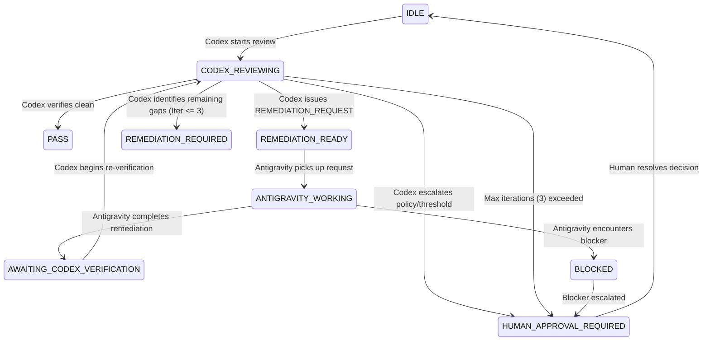

# WealthOS Universal Review & Remediation Protocol

- **Protocol Version:** 1.0.0
- **Authority:** Codex (Independent Reviewer / Verifier / Acceptance Authority) & Antigravity (Implementation Agent)
- **Scope:** Application-Wide Across All WealthOS Capabilities
- **Storage Location:** `reports/review/`

---

## 1. Absolute Separation of Duties

| Attribute | Codex Desktop | Antigravity IDE |
| :--- | :--- | :--- |
| **Primary Role** | **INDEPENDENT REVIEWER & ACCEPTANCE AUTHORITY** | **IMPLEMENTATION AGENT** |
| **Allowed Actions** | - Define review cohorts and runs<br>- Issue authoritative findings<br>- Issue `REMEDIATION_REQUEST.json`<br>- Verify developer deliverables<br>- Declare independent `PASS`/`FAIL`<br>- Escalate to `HUMAN_APPROVAL_REQUIRED` | - Inspect reviewer findings<br>- Inspect production source & data<br>- Implement generalized remediations<br>- Add/fix deterministic tests<br>- Run tests, typecheck, build<br>- Regenerate required outputs<br>- Issue `REMEDIATION_COMPLETE.json` |
| **Strictly Prohibited** | - Modifying production code directly<br>- Bypassing developer test suites | - Self-certifying or declaring `PASS`<br>- Grading own semantic interpretations<br>- Modifying Codex review findings<br>- Using symbol/company allowlists<br>- Inventing ungrounded thresholds<br>- Weakening evidence/PIT gates |

**Core Rule:** Developer `COMPLETE` is NOT Reviewer `PASS`.

---

## 2. Shared Control Plane & Automatic Handoff

The local Git repository is the sole communication bus between Antigravity and Codex. The user is **never** required to copy/paste findings, upload JSON, or relay diffs.

### Control Directory: `reports/review/control/`

1. `REVIEW_STATE.json`: Current state-machine status, active program, active run, and transition history.
2. `REMEDIATION_REQUEST.json`: Authoritative remediation contract issued by Codex.
3. `REMEDIATION_COMPLETE.json`: Authoritative completion contract issued by Antigravity.
4. `VERIFICATION_RECORD.json`: Verification verdict contract issued by Codex.
5. `HUMAN_APPROVAL_REQUIRED.json`: Escalation channel for decisions requiring human authorization.

---

## 3. Universal State Machine

The review framework operates under a strict 9-state finite state machine:



### Transition Authority

- **Only CODEX may set:** `CODEX_REVIEWING`, `REMEDIATION_READY`, `REMEDIATION_REQUIRED`, `PASS`, `HUMAN_APPROVAL_REQUIRED`, `IDLE`.
- **Only ANTIGRAVITY may set:** `ANTIGRAVITY_WORKING`, `AWAITING_CODEX_VERIFICATION`, `BLOCKED`.
- **Explicit Prohibition:** Antigravity can NEVER transition any program or review run to `PASS`.

---

## 4. Contract Specifications

### A. Remediation Request Contract (`REMEDIATION_REQUEST.json`)
Issued by Codex when findings require developer remediation:
```json
{
  "requestId": "STRING",
  "reviewId": "STRING",
  "program": "STRING",
  "iteration": "INTEGER (1-3)",
  "status": "READY_FOR_DEVELOPMENT",
  "reviewer": "CODEX",
  "reviewedHead": "GIT_COMMIT_SHA",
  "findings": [
    {
      "findingId": "STRING",
      "severity": "P0 | P1 | P2 | P3",
      "observedBehavior": "STRING",
      "evidence": ["STRING"],
      "requirementProvenance": "STRING"
    }
  ],
  "affectedCapabilities": ["STRING"],
  "affectedClaims": ["STRING"],
  "affectedBusinessModels": ["STRING"],
  "rootCauseAssessment": "STRING",
  "generalBehaviorRequired": "STRING",
  "acceptanceCriteria": ["STRING"],
  "testsRequired": ["STRING"],
  "regressionScope": "STRING",
  "protectedAreas": ["STRING"],
  "forbiddenShortcuts": ["STRING"]
}
```

### B. Remediation Complete Contract (`REMEDIATION_COMPLETE.json`)
Issued by Antigravity upon completing all implementation and test requirements:
```json
{
  "requestId": "STRING",
  "reviewId": "STRING",
  "iteration": "INTEGER",
  "status": "AWAITING_CODEX_VERIFICATION",
  "baselineBranch": "STRING",
  "baselineHead": "GIT_COMMIT_SHA",
  "completionHead": "GIT_COMMIT_SHA",
  "workingTreeBefore": "STRING",
  "workingTreeAfter": "STRING",
  "filesCreated": ["STRING"],
  "filesModified": ["STRING"],
  "productionFilesModified": ["STRING"],
  "implementationSummary": "STRING",
  "testsAdded": ["STRING"],
  "testsRun": ["STRING"],
  "testResults": "PASS | FAIL",
  "productionOutputsRegenerated": ["STRING"],
  "knownLimitations": ["STRING"],
  "developerConcerns": ["STRING"],
  "timestamp": "ISO_TIMESTAMP"
}
```

---

## 5. Universal Review Programs

The framework supports independent review across all actual WealthOS capabilities:

1. `PROGRAM_01_FUNDAMENTAL_CALIBRATION`: Multi-wave calibration (CAL_020, CAL_050, HOLDOUT_030, etc.) of fundamental metrics, trajectories, and business-model interpretations.
2. `PROGRAM_02_DATA_TRUTH_INTEGRITY`: Verification of canonical facts, OHLCV stores (DuckDB/Parquet/SQLite), dual-source reconciliation, and split/bonus adjustments.
3. `PROGRAM_03_SECURITY_IDENTITY_UNIVERSE`: MasterTickers resolution, ISIN/NSE symbol mapping, survivorship bias controls, and listing platform classifications.
4. `PROGRAM_04_VALUATION_GOVERNANCE`: Forensic valuation models, PE/PB/EV multiples, FCF yields, and reverse-DCF sanity.
5. `PROGRAM_05_TECHNICAL_STRATEGY`: S1-S10 execution engines, VPA 3-leg swing, momentum overlays, and signal selectivity.
6. `PROGRAM_06_PORTFOLIO_ACCOUNTING`: Multi-broker ingestion, lot tracking, corporate action ledger, post-tax XIRR, and family office allocation.
7. `PROGRAM_07_EVIDENCE_PROVENANCE_PIT`: As-of timeline enforcement, point-in-time facts, concall/report micro-RAG citations, and synthetic data quarantine.
8. `PROGRAM_08_UNIVERSAL_API_MCP`: HTTP/SSE transports, authorization planes (Product vs Review), tool execution contracts, and latency budgets.
9. `PROGRAM_09_UI_BROWSER_JOURNEYS`: End-to-end user workflows, drawer interactions, chart rendering, and report exports.

---

## 6. Implementation Principles & Guardrails

1. **Strict Generalization:**
   - No company/symbol conditionals (`if (symbol === 'TCS')`).
   - No company allowlists or cohort-specific branch logic.
   - Classification must derive from legitimate business-model attributes (e.g., `BANK`, `NBFC`, `IT_SERVICES`, `MANUFACTURING`).
2. **Threshold Discipline:**
   - Existing arbitrary thresholds (50 bps, 5%, 12%, 18%) cannot be treated as validated without empirical grounding.
   - Context-aware principles must replace rigid universal thresholds where economically warranted.
   - If an ungrounded threshold materially drives output, flag `HUMAN_APPROVAL_REQUIRED`.
3. **Data vs. Interpretation Discipline:**
   - Never alter interpretation logic to mask data defects.
   - Data errors require data-pipeline fixes; arithmetic errors require derivation fixes; narrative errors require interpretation fixes.
4. **Evidence & PIT Integrity:**
   - Source validation, PIT timestamping, and synthetic quarantine are immutable.
   - Synthetic fixtures can only reside in isolated test files and can never serve as production evidence.
5. **Protected Production Areas:**
   - Technical strategy mathematics (S1-S10), portfolio accounting, post-tax XIRR, tax harvesting, and CP2.1 frozen controls cannot be altered during fundamental calibration.
6. **Iteration Ceiling:**
   - Maximum 3 remediation attempts per systemic finding. If unresolved after iteration 3, escalate to `HUMAN_APPROVAL_REQUIRED`.
